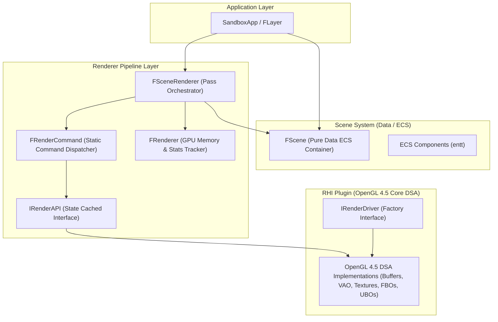
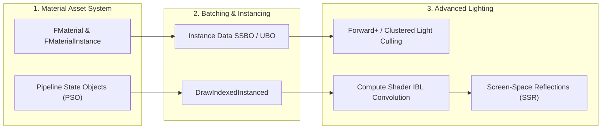

# Auditoría Arquitectónica Completa — LeonEngine2 Renderer

> **Auditoría técnica del subsistema gráfico 3D, OpenGL RHI, PBR, Iluminación, Sombras y Materiales.**  
> Estado actualizado tras la ejecución de las Fases 1 a 12 de refactorización y modernización.

---

## 1. Arquitectura General del Renderer

### 1.1 Diagrama de Capas Actual

### 1.2 Separación de Responsabilidades

| Responsabilidad | Dónde reside | Estado de Diseño |
| :--- | :--- | :--- |
| **Contenedor de Datos de Escena (ECS)** | `FScene` / `Components.hpp` | **CORRECTO** — Desacoplado de la lógica de render. |
| **Orquestación de Pases de Render** | `FSceneRenderer` | **CORRECTO / MEJORABLE** — Pipeline centralizado, preparado para evolucionar a RenderGraph. |
| **Gestión de Estado OpenGL (State Cache)** | `FOpenGLRenderAPI` | **CORRECTO** — State Cache en CPU para evitar llamadas redundantes de driver. |
| **Sombras Direccionales (CSM)** | `FSceneRenderer` / `PBR_Lit.glsl` | **CORRECTO** — Unificado en 1 FBO con `GL_TEXTURE_2D_ARRAY` y `sampler2DArrayShadow`. |
| **UBOs de Cámara e Iluminación** | `FSceneRenderer` (Bindings 0 y 1, `std140`) | **CORRECTO** — Datos compartidos eficientemente sin uniforms por draw call. |
| **Creación de Recursos RHI** | `IRenderDriver` / `FRenderDriverRegistry` | **CORRECTO** — Factoría agnóstica a la API. |
| **Implementación de Recursos GPU** | `Plugins/RHI/OpenGL/` | **CORRECTO** — OpenGL 4.5 Direct State Access (DSA) con almacenamiento inmutable. |

---

## 2. Historial de Problemas Auditados y Resueltos

---

### ✅ RESUELTO: Extracción del Pipeline de Renderizado fuera de `FScene`
- **Problema Inicial**: `FScene` actuaba como *God Object* conteniendo toda la lógica de dibujo, buffers y pases.
- **Solución Aplicada**: Creación de `FSceneRenderer`. `FScene` se redujo a un contenedor puro de entidades y componentes (`entt`).

---

### ✅ RESUELTO: Modernización a OpenGL 4.5 Core Direct State Access (DSA)
- **Problema Inicial**: La capa RHI utilizaba llamadas estilo OpenGL 3.3 (`glGen*`, `glBind*`, `glTexImage2D`).
- **Solución Aplicada**:
  - `OpenGLBuffer.cpp`: `glCreateBuffers`, `glNamedBufferStorage`, `glNamedBufferData`, `glNamedBufferSubData`.
  - `OpenGLVertexArray.cpp`: `glCreateVertexArrays`, `glVertexArrayVertexBuffer`, `glVertexArrayAttribFormat`, `glVertexArrayAttribBinding`, `glEnableVertexArrayAttrib`, `glVertexArrayElementBuffer`.
  - `OpenGLTexture2D.cpp` & `OpenGLTextureCube.cpp`: `glCreateTextures`, `glTextureStorage2D`, `glTextureSubImage2D`/`3D`, `glTextureParameteri`, `glGenerateTextureMipmap`, `glBindTextureUnit`.
  - `OpenGLFramebuffer.cpp`: `glCreateFramebuffers`, `glNamedFramebufferTexture`, `glNamedFramebufferTextureLayer`, `glNamedFramebufferDrawBuffers`, `glCheckNamedFramebufferStatus`, `glBlitNamedFramebuffer`.
  - `OpenGLUniformBuffer.cpp`: `glCreateBuffers`, `glNamedBufferData`, `glNamedBufferSubData`.

---

### ✅ RESUELTO: Unificación de Cascaded Shadow Maps en 2D Texture Array
- **Problema Inicial**: 3 FBOs y 3 texturas de profundidad individuales forzaban a tener 3 samplers separados y branches `if/else` en el fragment shader.
- **Solución Aplicada**:
  - Implementado `DEPTH32F_ARRAY_SHADOW` en `FFramebufferSpecification` con soporte multicapa (`ArrayLayers = 3`).
  - `FSceneRenderer` utiliza un único FBO con `GL_TEXTURE_2D_ARRAY` de 3 capas de 2048x2048 y asocia cada capa con `AttachDepthTextureLayer(cascade)`.
  - Corrección de planos de proyección ortográfica `nearPlane = -maxZ` y `farPlane = -minZ` para capturar la profundidad de sombra completa.
  - `PBR_Lit.glsl` utiliza un único `layout(binding = 10) uniform sampler2DArrayShadow u_CascadeShadowMap;` indexando por capa directamente sin branches.

---

### ✅ RESUELTO: CPU State Caching en `FOpenGLRenderAPI`
- **Problema Inicial**: Llamadas redundantes a `glEnable(GL_DEPTH_TEST)`, `glDepthMask`, `glDepthFunc`, `glCullFace`, `glBlendFunc`, `glBindFramebuffer`.
- **Solución Aplicada**: Variables miembro en CPU para registrar el estado activo y filtrar llamadas redundantes. Activado `GL_TEXTURE_CUBE_MAP_SEAMLESS` en inicialización.

---

### ✅ RESUELTO: Modelo Físico PBR de Luces e Iluminación Directa
- **Problema Inicial**: Existencia de parámetros Phong obsoletos (`AmbientIntensity`, `DiffuseIntensity`, `SpecularIntensity`) y atenuación cuadrática empírica.
- **Solución Aplicada**: Unificación en `Color` + `Intensity` única (radiancia física) y atenuación inversa al cuadrado con radio físico (`Radius`) estilo UE4/Filament.

---

### ✅ RESUELTO: Matriz de Reflexión Plana & Filtrado IBL Monte Carlo
- **Problema Inicial**: La cámara de reflejo se desplazaba sin aplicar la transformación simétrica $Y \to -Y$, proyectando reflejos al fondo del suelo en lugar de debajo de los objetos. Además, el muestreo de HDR por vecino más cercano sin clamp generaba fireflies (cuadros blancos) en el mapa de prefiltrado IBL.
- **Solución Aplicada**:
  - `SceneRenderer.cpp`: Matriz de vista construida mediante $V_{\text{reflect}} = V_{\text{main}} \times \text{scale}(1, -1, 1)$, logrando proyección $1:1$ de los reflejos directamente debajo de cada objeto.
  - `IBLGenerator.cpp`: Interpolación bilineal en el muestreo equirectangular y clamping de radiancia en el muestreo GGX de `PrefilterMap`, eliminando artefactos pixelados en superficies dieléctricas.
  - `PBR_Lit.glsl`: Mapeo de reflejo planar restringido a superficies horizontales ($N.y > 0.5$).

---

## 3. Hoja de Ruta para la Siguiente Etapa del Renderer

1. **Fase 13 — Sistema de Materiales de Primer Orden (`FMaterial` / `FMaterialInstance`)**:
   - Desacoplar los parámetros de materiales del ECS hacia recursos gestionados con caching de uniforms y descriptors.
2. **Fase 14 — Instanciación y Batching (`DrawIndexedInstanced` / SSBOs)**:
   - Pasar matrices de transformación `u_Model` y `u_NormalMatrix` a través de un SSBO o Instance Buffer para reducir el overhead de draw calls de $O(N)$ a $O(\text{batches})$.
3. **Fase 15 — Compute Shaders para IBL & Forward+ Clustered Lighting**:
   - Trasladar la convolución de IBL a Compute Shaders en GPU.
   - Implementar particionado de frustum en celdas 3D (*Clustered Forward+*) para soportar cientos de luces dinámicas con sombras omnidireccionales.
