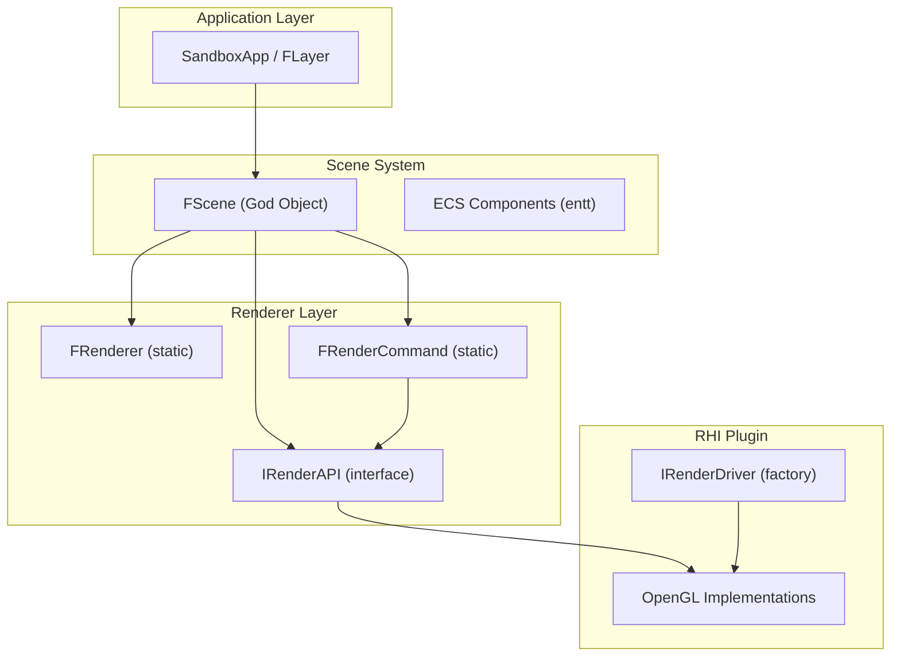

# Auditoría Arquitectónica Completa — LeonEngine2 Renderer

> **Auditoría realizada sobre todo el código fuente del motor.** Cada hallazgo incluye ubicación exacta, severidad, consecuencias y solución recomendada.

---

## 1. Arquitectura General del Renderer

### 1.1 Diagrama de capas actual



### 1.2 Evaluación de la separación de responsabilidades

| Responsabilidad                                                    | Dónde vive actualmente                                                                   | Evaluación                                                  |
| ------------------------------------------------------------------ | ---------------------------------------------------------------------------------------- | ----------------------------------------------------------- |
| Render passes (shadow, reflection, geometry, skybox, post-process) | [Scene.cpp](file:///c:/Users/Daniel/Desktop/Code/LeonEngine2/Engine/src/scene/Scene.cpp) | **CRÍTICO** — toda la lógica de rendering está en la escena |
| Estado OpenGL (depth, blend, cull)                                 | Disperso en Scene.cpp, llamadas directas a FRenderCommand                                | **ALTO** — sin pipeline state objects                       |
| Uniform uploads                                                    | Scene.cpp, por entidad, por shader                                                       | **ALTO** — acoplamiento directo escena↔shader               |
| Material binding                                                   | Scene.cpp L484-556                                                                       | **ALTO** — lógica de material hardcoded en la escena        |
| Resource creation                                                  | FRenderDriverRegistry / factory pattern                                                  | **CORRECTO**                                                |
| GPU resource lifetime                                              | RAII en destructores de wrappers                                                         | **CORRECTO**                                                |
| GPU memory tracking                                                | FRenderer::OnGPUAlloc/Free manual                                                        | **MEDIO** — frágil pero funcional                           |

---

## 2. Problemas Detectados (Ordenados por Severidad)

---

### 🔴 CRÍTICO-01: FScene es un God Object de Rendering

**Qué ocurre:** [Scene.cpp](file:///c:/Users/Daniel/Desktop/Code/LeonEngine2/Engine/src/scene/Scene.cpp) (822 líneas) contiene **toda** la lógica de rendering del motor: shadow mapping, planar reflections, geometry pass, skybox, post-processing, IBL management, UBO uploads, material binding, texture slot assignment.

**Dónde:** [Scene.hpp L60-108](file:///c:/Users/Daniel/Desktop/Code/LeonEngine2/Engine/include/scene/Scene.hpp#L60-L108), [Scene.cpp L136-822](file:///c:/Users/Daniel/Desktop/Code/LeonEngine2/Engine/src/scene/Scene.cpp#L136-L822)

**Por qué es un problema:**

- La escena debería representar el **qué** (datos del mundo), no el **cómo** (rendering).
- Imposible testear render passes individualmente.
- Imposible añadir un editor sin duplicar lógica.
- Imposible implementar deferred rendering, forward+, o cualquier técnica alternativa sin reescribir FScene.
- Cada nuevo render pass incrementa la complejidad de una única clase.

**Consecuencias:** Bloquea deferred rendering, render graph, multi-viewport, editor, y cualquier cambio significativo en el pipeline.

**Tipo:** Decisión arquitectónica — callejón sin salida.

**Solución:** Extraer toda la lógica de rendering de FScene a un `FSceneRenderer` o `FRenderPipeline` dedicado. La escena solo debería exponer datos (entidades, componentes) y el renderer consumirlos.

**¿Requiere refactor ahora?** **Sí — es el bloqueo principal para evolucionar.**

---

### 🔴 CRÍTICO-02: FRenderer es una cáscara vacía — no aporta arquitectura

**Qué ocurre:** [FRenderer](file:///c:/Users/Daniel/Desktop/Code/LeonEngine2/Engine/include/renderer/Renderer.hpp) solo contiene:

- `BeginScene()`/`EndScene()` que apenas setean una VP matrix
- `Submit()` que simplemente binds shader + VAO + draw (¡y ni siquiera se usa en el pipeline real!)
- Contadores de stats

La escena ignora completamente `FRenderer::Submit*()` y llama directamente a `FRenderCommand::DrawIndexed()`.

**Dónde:** [Renderer.hpp L12-70](file:///c:/Users/Daniel/Desktop/Code/LeonEngine2/Engine/include/renderer/Renderer.hpp#L12-L70), [Renderer.cpp](file:///c:/Users/Daniel/Desktop/Code/LeonEngine2/Engine/src/renderer/Renderer.cpp)

**Por qué es un problema:**

- FRenderer existe como abstracción pero no se usa. Es código muerto arquitectónico.
- `Submit()` setea `u_ViewProjection` y `u_ViewPos` por uniforms individuales, pero la escena usa UBOs para lo mismo — **duplicación de mecanismos**.
- Las stats se duplican: `Submit()` cuenta draw calls, pero `FRenderCommand::DrawIndexed()` también llama a `RecordDrawIndexed()`.

**Tipo:** Falsa abstracción / código legacy.

**Solución:** Eliminar FRenderer en su forma actual. Mover stats a FRenderCommand o al futuro SceneRenderer. La funcionalidad real de rendering debe vivir en un SceneRenderer con un pipeline explícito.

---

### 🔴 CRÍTICO-03: GLSL #version 330 core — OpenGL 3.3 mínimo bloquea features modernos

**Qué ocurre:** Todos los shaders declaran `#version 330 core`:

- [PBR_Lit.glsl L2](file:///c:/Users/Daniel/Desktop/Code/LeonEngine2/Engine/Assets/Shaders/PBR_Lit.glsl#L2)
- [ShadowDepth.glsl L2](file:///c:/Users/Daniel/Desktop/Code/LeonEngine2/Engine/Assets/Shaders/ShadowDepth.glsl#L2)
- [Skybox.glsl L2](file:///c:/Users/Daniel/Desktop/Code/LeonEngine2/Engine/Assets/Shaders/Skybox.glsl#L2)
- [PostProcess.glsl L2](file:///c:/Users/Daniel/Desktop/Code/LeonEngine2/Engine/Assets/Shaders/PostProcess.glsl#L2)

**Pero el código C++ ya usa `glClearTexImage` (4.4), `glGenTextures`/`glBindTexture` en lugar de DSA (`glCreateTextures`/`glTextureStorage2D`, 4.5).**

La ventana pide OpenGL 3.3: [Window.cpp L47-48](file:///c:/Users/Daniel/Desktop/Code/LeonEngine2/Engine/src/core/Window.cpp#L47-L48).

**Por qué es un problema:**

- Con 3.3 no hay acceso a: compute shaders (4.3), shader storage buffers SSBO (4.3), DSA (4.5), `glTextureBarrier` (4.5), tessellation shaders (4.0), indirect drawing (4.0/4.3), multi-draw indirect (4.3), bindless textures, image load/store.
- **Esto bloquea completamente**: GPU-driven rendering, clustered/forward+, compute-based culling, SSAO, SSR en compute, bloom de calidad, cualquier técnica moderna.
- `glClearTexImage` (usado en [OpenGLFramebuffer.cpp L260](file:///c:/Users/Daniel/Desktop/Code/LeonEngine2/Plugins/RHI/OpenGL/src/OpenGLFramebuffer.cpp#L260)) ya requiere 4.4, así que el mínimo real no es 3.3 — es inconsistente.

**Tipo:** Decisión arquitectónica que limita el futuro.

**Solución:** Subir a **OpenGL 4.5 core** como mínimo. Esto es ampliamente soportado (>99% de GPUs de escritorio modernas). Actualizar hints GLFW, shaders a `#version 450 core`, y adoptar DSA en toda la RHI.

**¿Requiere refactor ahora?** Sí, debe hacerse antes de añadir compute shaders o SSBOs.

---

### 🔴 CRÍTICO-04: No hay Debug Context ni `glDebugMessageCallback`

**Qué ocurre:** No se solicita `GLFW_OPENGL_DEBUG_CONTEXT` ni se registra `glDebugMessageCallback` en ningún lugar.

**Dónde:** [OpenGLContext.cpp](file:///c:/Users/Daniel/Desktop/Code/LeonEngine2/Plugins/RHI/OpenGL/src/OpenGLContext.cpp), [Window.cpp L46-52](file:///c:/Users/Daniel/Desktop/Code/LeonEngine2/Engine/src/core/Window.cpp#L46-L52)

**Por qué es un problema:** Sin debug context, los errores de OpenGL son **silenciosos**. Bindings incorrectos, formatos incompatibles, estados inválidos — todo pasa sin aviso. Es como compilar sin warnings.

**Tipo:** Mala práctica grave.

**Solución:** En Debug builds, activar `glfwWindowHint(GLFW_OPENGL_DEBUG_CONTEXT, GL_TRUE)` y registrar `glDebugMessageCallback` con filtro por severidad. Esto es el mecanismo **estándar y moderno** de validación OpenGL.

---

### 🟠 ALTO-01: Per-Object Uniform Upload Pattern — No escala

**Qué ocurre:** En [Scene.cpp L431-562](file:///c:/Users/Daniel/Desktop/Code/LeonEngine2/Engine/src/scene/Scene.cpp#L431-L562), para **cada entidad**, el código ejecuta:

- `mesh.Shader->Bind()`
- ~15 llamadas `SetInt()` para configurar flags de textura
- ~5 llamadas `SetFloat()` / `SetFloat3()` para parámetros PBR
- 3-5 llamadas `Bind()` para texturas de material
- 3-5 llamadas `Bind()` para shadow maps (¡las mismas para cada entidad!)
- 3 llamadas `Bind()` para IBL maps (¡las mismas para cada entidad!)
- `SetMat4("u_Model", ...)`

**Por qué es un problema:**

- Shadow maps y IBL maps son **globales por frame** — se re-bindan por cada objeto sin necesidad.
- Cada `SetInt`/`SetFloat` genera una llamada `glGetUniformLocation` (aunque cacheada) + `glUniform*`.
- Con 100 objetos: ~2000 llamadas GL redundantes por frame.
- No hay sorting por shader/material para minimizar state changes.

**Tipo:** Problema de rendimiento y escalabilidad.

**Solución:**

1. Separar uniforms por frecuencia: per-frame (en UBOs), per-material (en UBOs o SSBOs), per-object (solo `u_Model`).
2. Bindear shadow maps e IBL maps **una vez por frame**, no por objeto.
3. Implementar sorting por material/shader antes del draw loop.

---

### 🟠 ALTO-02: HDR Solar Spike CPU Preprocessing — Hack en carga de texturas

**Qué ocurre:** [OpenGLTexture2D.cpp L47-85](file:///c:/Users/Daniel/Desktop/Code/LeonEngine2/Plugins/RHI/OpenGL/src/OpenGLTexture2D.cpp#L47-L85) contiene un filtro Gaussiano CPU que busca el píxel más brillante de la imagen HDR y lo suaviza con un kernel 18x18 si `luminance > 100`.

```cpp
// Pre-filter HDR solar delta-spike into a smooth Gaussian profile
if (maxVal > 100.0f) {
    int radius = 18;
    float sigma = 7.0f;
    // ... blur loop with magic constants ...
}
```

**Por qué es un problema:**

- **Modifica los datos de la textura de entrada** — la textura cargada ya no es la original.
- Parámetros hardcoded (`100.0f`, `radius=18`, `sigma=7.0f`, `0.20f`, `0.12f`) — solo funcionan para determinadas imágenes HDR.
- Esto es un **parche visual** para un problema que debería resolverse en el pipeline de prefiltering, no mutando los datos de entrada.
- Una clase de textura no debería modificar el contenido de la imagen — viola single responsibility.

**Tipo:** Hack / workaround / solución demo-specific.

**Solución:** Eliminar el preprocessing de la textura. El problema real (artefactos solares en IBL) se resuelve correctamente con importance sampling con MIS (multiple importance sampling) en el prefilter pass, o con clamping durante la convolución IBL, no mutando la textura.

---

### 🟠 ALTO-03: BRDF LUT generada en RGBA8 (8-bit) — pérdida de precisión

**Qué ocurre:** [IBLGenerator.cpp L99-125](file:///c:/Users/Daniel/Desktop/Code/LeonEngine2/Engine/src/renderer/IBLGenerator.cpp#L99-L125) genera la BRDF LUT como `FTexture2D::Create(InSize, InSize)` que crea una textura RGBA8. Los valores float de `IntegrateBRDF()` se cuantizan a 8-bit unsigned.

```cpp
uint8_t r = static_cast<uint8_t>(std::clamp(integrated.x * 255.0f, 0.0f, 255.0f));
uint8_t g = static_cast<uint8_t>(std::clamp(integrated.y * 255.0f, 0.0f, 255.0f));
```

**Por qué es un problema:**

- La BRDF LUT necesita precisión flotante. 8-bit introduce banding visible en materiales con roughness bajo.
- Motores de referencia (Unreal, Filament) usan RG16F o RG32F.

**Tipo:** Mala práctica PBR.

**Solución:** Crear la BRDF LUT como textura RG16F. Requiere extender `FTexture2D` para soportar formatos de creación configurables, o crear una textura directa con `glTexImage2D(GL_RG16F)`.

---

### 🟠 ALTO-04: IBL Convolution ejecutada en CPU — Bloquea el hilo principal

**Qué ocurre:** [IBLGenerator.cpp](file:///c:/Users/Daniel/Desktop/Code/LeonEngine2/Engine/src/renderer/IBLGenerator.cpp) calcula toda la convolución IBL (irradiance, prefilter 5 mip levels, BRDF LUT) en CPU con loops anidados, sample por sample.

- Irradiance: 32x32x6 faces × ~1200 samples por texel
- Prefilter: 128x128x6x5 mips × 128 samples por texel
- BRDF: 256x256 × 512 samples por texel

**Por qué es un problema:**

- Bloquea el hilo principal durante carga — visible como freeze.
- Es 100-1000x más lento que la versión GPU (que usa un shader de convolución renderizando a un cubemap FBO).
- No permite re-generar IBL en runtime (ej: cambio dinámico de hora del día).

**Tipo:** Decisión técnica que limita el rendimiento y la experiencia.

**Solución:** Mover la convolución IBL a GPU usando fragment shaders especializados que rendericen a cubemap FBOs. Esto es lo estándar en todos los motores modernos.

**¿Requiere refactor ahora?** Puede esperar si no hay cambios dinámicos de ambiente, pero debería hacerse antes de implementar reflection probes o day-night cycles.

---

### 🟠 ALTO-05: Lighting model usa Ambient/Diffuse/Specular Intensity separados — no es PBR correcto

**Qué ocurre:** [Light.hpp](file:///c:/Users/Daniel/Desktop/Code/LeonEngine2/Engine/include/renderer/Light.hpp) define:

```cpp
float AmbientIntensity{0.15f};
float DiffuseIntensity{0.7f};
float SpecularIntensity{0.4f};
```

Y en [PBR_Lit.glsl L318](file:///c:/Users/Daniel/Desktop/Code/LeonEngine2/Engine/Assets/Shaders/PBR_Lit.glsl#L318):

```glsl
vec3 radiance = u_DirLight.color.rgb * u_DirLight.intensities.x; // diffuseIntensity
vec3 specular = (numerator / denominator) * u_DirLight.intensities.y; // specularIntensity
```

**Por qué es un problema:**

- En PBR **correcto**, una luz tiene una sola propiedad: **radiancia** (color × intensidad). No hay "diffuse intensity" vs "specular intensity" separados.
- La separación ambient/diffuse/specular es del modelo **Phong legacy**, no de la reflectancia basada en física.
- Permite configuraciones físicamente incorrectas (ej: specular 0.4 con diffuse 0.7 viola conservación de energía a nivel de la fuente de luz).
- Rompe la coherencia cuando se mezclan luces directas con IBL.

**Tipo:** Deuda técnica por diseño Phong heredado.

**Solución:** Las luces deben tener solo `Color` e `Intensity` (radiancia). Eliminar `AmbientIntensity`, `DiffuseIntensity`, `SpecularIntensity`. La separación diffuse/specular la hace el BRDF, no la fuente de luz.

---

### 🟠 ALTO-06: Point Light Attenuation — modelo inconsistente

**Qué ocurre:** [Light.hpp](file:///c:/Users/Daniel/Desktop/Code/LeonEngine2/Engine/include/renderer/Light.hpp#L22-L29) define `Constant`, `Linear`, `Quadratic` (modelo Phong), pero [PBR_Lit.glsl L347-351](file:///c:/Users/Daniel/Desktop/Code/LeonEngine2/Engine/Assets/Shaders/PBR_Lit.glsl#L347-L351) usa un modelo UE4-style con radius + smooth falloff:

```glsl
float radius = u_PointLights[i].attenuation.x > 0.0 ? u_PointLights[i].attenuation.x : 25.0;
float factor = clamp(1.0 - (distSq*distSq)/(radius⁴), 0.0, 1.0);
float attenuation = (factor * factor) / (distSq + 1.0);
```

**Pero `attenuation.x` en el UBO almacena `Constant` (que siempre es 1.0)**, no el radio. El campo `radius` en el shader siempre lee 1.0 (= `Constant`), lo que produce un radio de atenuación de ~1 metro.

**Dónde:** [Scene.cpp L715-717](file:///c:/Users/Daniel/Desktop/Code/LeonEngine2/Engine/src/scene/Scene.cpp#L715-L717) empaqueta `Constant` en `Attenuation.x`.

**Por qué es un problema:**

- El struct C++ (`Constant`, `Linear`, `Quadratic`) **no corresponde** con lo que el shader espera (`Radius`).
- `Linear` y `Quadratic` se envían al UBO pero **nunca se leen** en el shader.
- La atenuación resultante probablemente no produce el resultado esperado con el valor por defecto de `Constant = 1.0`.

**Tipo:** Bug latente / inconsistencia datos↔shader.

**Solución:** Decidir un modelo de atenuación y aplicarlo consistentemente: o inverse-square con radius (moderno), o constant/linear/quadratic (legacy). Recomendación: radius + inverse-square como UE4/Filament.

---

### 🟡 MEDIO-01: No hay separación Sampler / Texture

**Qué ocurre:** Parámetros de sampling (filter, wrap) se configuran per-textura en el constructor ([OpenGLTexture2D.cpp L19-22](file:///c:/Users/Daniel/Desktop/Code/LeonEngine2/Plugins/RHI/OpenGL/src/OpenGLTexture2D.cpp#L19-L22)). No existen objetos Sampler independientes.

**Por qué es un problema:**

- Para shadow maps se necesita `GL_COMPARE_REF_TO_TEXTURE`, para IBL `GL_CLAMP_TO_EDGE`, para albedo `GL_REPEAT`, etc.
- Actualmente cada caso se configura de forma distinta con `glTexParameteri` disperso.
- OpenGL 3.3+ soporta sampler objects (`glGenSamplers`), que son el mecanismo correcto y moderno.

**Solución:** Crear una abstracción `FSampler` con `FSamplerDescriptor` y usar `glBindSampler()`. Permite reutilizar configuraciones de muestreo entre texturas.

---

### 🟡 MEDIO-02: Shadow Map Depth Attachment usa DEPTH24_STENCIL8 — desperdicio de stencil

**Qué ocurre:** [Scene.cpp L26](file:///c:/Users/Daniel/Desktop/Code/LeonEngine2/Engine/src/scene/Scene.cpp#L26) crea los shadow framebuffers con `DEPTH24STENCIL8_SHADOW`.

**Por qué es un problema:**

- Las shadow maps no necesitan stencil buffer — se desperdician 8 bits por texel.
- `GL_DEPTH_COMPONENT24` o `GL_DEPTH_COMPONENT32F` serían más eficientes.
- Con `GL_DEPTH_COMPONENT32F` se gana precision en escenas grandes (CSM far cascades).

**Solución:** Añadir `EFramebufferTextureFormat::DEPTH32F` y usarlo para shadow maps. También permite usar `GL_DEPTH_COMPONENT16` para la cascade más cercana (optimización).

---

### 🟡 MEDIO-03: Planar Reflection — técnica muy limitada y acoplada

**Qué ocurre:** [Scene.cpp L291-429](file:///c:/Users/Daniel/Desktop/Code/LeonEngine2/Engine/src/scene/Scene.cpp#L291-L429) implementa planar reflections con cámara invertida, hardcoded al plano Y=0.

**Por qué es un problema:**

- Solo funciona para suelos horizontales planos en Y=0.
- Re-renderiza toda la escena (incluyendo skybox, text, meshes) — coste completo.
- El UBO de cámara se sobreescribe temporalmente y luego restaurado — estado global implícito.
- No escala a múltiples superficies reflectantes.
- Bloquea la evolución hacia SSR (que no necesita un pass extra).

**Tipo:** Técnica que funciona como demo pero bloquea evolución.

**Solución:** Mantener temporalmente pero marcarla como deprecada. Implementar SSR como reemplazo y eventualmente reflection probes para superficies no planares.

---

### 🟡 MEDIO-04: Cascaded Shadow Maps — hardcoded constants

**Qué ocurre:** [Scene.cpp L143-147](file:///c:/Users/Daniel/Desktop/Code/LeonEngine2/Engine/src/scene/Scene.cpp#L143-L147):

```cpp
float farClip = 75.0f;
float split0 = 4.5f;
float split1 = 20.0f;
float split2 = farClip;
```

Y `lightPos = center - lightDirNorm * 40.0f` ([L183](file:///c:/Users/Daniel/Desktop/Code/LeonEngine2/Engine/src/scene/Scene.cpp#L183)), `zMargin = 30.0f` ([L203](file:///c:/Users/Daniel/Desktop/Code/LeonEngine2/Engine/src/scene/Scene.cpp#L203)).

**Por qué es un problema:**

- Valores mágicos que solo funcionan para una escena de tamaño específico.
- No hay PSSM (Practical Split Scheme Calculation) — los splits deberían calcularse logarítmicamente.
- La distancia del "sun camera" (40.0f) es arbitraria y puede causar clipping con escenas grandes.

**Solución:** Calcular splits con el esquema PSSM (mezcla logarítmica/lineal). Exponer parámetros como configuración. Calcular la distancia de la cámara de luz desde las AABB del frustum.

---

### 🟡 MEDIO-05: `transpose(inverse(mat3(u_Model)))` en vertex shader — overhead por fragmento

**Qué ocurre:** [PBR_Lit.glsl L33](file:///c:/Users/Daniel/Desktop/Code/LeonEngine2/Engine/Assets/Shaders/PBR_Lit.glsl#L33):

```glsl
mat3 normalMatrix = transpose(inverse(mat3(u_Model)));
```

**Por qué es un problema:**

- `inverse()` de una matriz en GPU **por cada vértice** es costoso y redundante.
- Debería calcularse en CPU una vez por objeto y subirse como uniform.
- Para objetos sin non-uniform scaling, `mat3(u_Model)` es suficiente.

**Solución:** Subir `u_NormalMatrix` como uniform `mat3` precalculado en CPU. Solo calcular `transpose(inverse(mat3(model)))` cuando la escala no es uniforme.

---

### 🟡 MEDIO-06: `ShaderDataTypeSize` como función `static` en header — ODR violation potencial

**Qué ocurre:** [Buffer.hpp L15-43](file:///c:/Users/Daniel/Desktop/Code/LeonEngine2/Engine/include/renderer/Buffer.hpp#L15-L43) define `ShaderDataTypeSize()` como `static` function en el header. Cada translation unit que incluya este header tiene su propia copia.

**Solución:** Marcarlo como `inline` (C++17) o moverlo a Buffer.cpp.

---

### 🟡 MEDIO-07: `Unbind()` methods en todas las abstracciones — anti-pattern OpenGL moderno

**Qué ocurre:** Todas las clases GPU (`FVertexArray`, `FVertexBuffer`, `FIndexBuffer`, `FShader`, `FTexture2D`, etc.) tienen `Unbind()` que hace `glBind*(0)`.

**Por qué es un problema:**

- En OpenGL moderno con VAOs, unbinding no es necesario — el siguiente `Bind()` sobrescribe el estado.
- Cada `Unbind()` es una llamada GL extra e innecesaria.
- Con DSA (OpenGL 4.5), binding/unbinding es completamente innecesario.

**Solución:** Eliminar métodos `Unbind()` de la API. Si se migra a DSA, binding se vuelve irrelevante.

---

### 🟡 MEDIO-08: SetBlendState fuerza blend function — acoplamiento estado

**Qué ocurre:** [OpenGLRenderAPI.cpp L74-81](file:///c:/Users/Daniel/Desktop/Code/LeonEngine2/Plugins/RHI/OpenGL/src/OpenGLRenderAPI.cpp#L74-L81):

```cpp
void FOpenGLRenderAPI::SetBlendState(bool InEnabled) {
    if (InEnabled) {
        glEnable(GL_BLEND);
        glBlendFunc(GL_SRC_ALPHA, GL_ONE_MINUS_SRC_ALPHA); // <-- always SrcAlpha
    }
```

**Por qué es un problema:** Cada vez que se activa blend, se sobreescribe la blend function. Si alguien previamente llamó `SetBlendFunc()` con valores diferentes, se pierden.

**Solución:** `SetBlendState` solo debe habilitar/deshabilitar `GL_BLEND`, sin modificar la función.

---

### 🟢 BAJO-01: No se usa DSA en ningún lugar

**Qué ocurre:** Toda la RHI usa `glGen*` + `glBind*` + `glTex*` (bind-to-edit pattern), nunca `glCreate*` + `glTextureStorage2D` + `glTextureSubImage2D` (DSA, 4.5).

**Solución:** Al subir a OpenGL 4.5, migrar a DSA progresivamente. DSA elimina binding state implícito, reduce errores, y es más claro.

---

### 🟢 BAJO-02: No se usa immutable storage (`glTexStorage2D`)

**Qué ocurre:** Todas las texturas usan `glTexImage2D`, que crea almacenamiento mutable.

**Solución:** Usar `glTexStorage2D` + `glTexSubImage2D`. Immutable storage es más eficiente, previene errores de formato, y permite el driver optimizar.

---

### 🟢 BAJO-03: Uniform location cache usa `std::string` como key — overhead de hashing

**Qué ocurre:** [OpenGLShader.hpp L39](file:///c:/Users/Daniel/Desktop/Code/LeonEngine2/Plugins/RHI/OpenGL/include/OpenGLShader.hpp#L39):

```cpp
mutable std::unordered_map<std::string, int> m_UniformLocationCache;
```

**Solución:** Aceptable para un motor en desarrollo. A futuro, considerar pre-resolver todos los locations tras compilación y usar indices directos.

---

### 🟢 BAJO-04: `glGetIntegerv(GL_FRAMEBUFFER_BINDING)` en cada frame — query innecesario

**Qué ocurre:** [Scene.cpp L628](file:///c:/Users/Daniel/Desktop/Code/LeonEngine2/Engine/src/scene/Scene.cpp#L628):

```cpp
uint32_t previousFBO = FRenderCommand::GetFramebufferBinding();
```

**Solución:** Trackear el FBO activo en CPU en lugar de consultar al driver.

---

## 3. PBR — Evaluación Detallada

### Lo que está CORRECTO:

| Aspecto                                  | Estado                                           | Ubicación                                                                                                                  |
| ---------------------------------------- | ------------------------------------------------ | -------------------------------------------------------------------------------------------------------------------------- |
| Cook-Torrance BRDF                       | ✅ Correcto                                      | [PBR_Lit.glsl L142-173](file:///c:/Users/Daniel/Desktop/Code/LeonEngine2/Engine/Assets/Shaders/PBR_Lit.glsl#L142-L173)     |
| Trowbridge-Reitz GGX NDF                 | ✅ Correcto                                      | L142-153                                                                                                                   |
| Smith Schlick-GGX Geometry               | ✅ Correcto                                      | L156-173                                                                                                                   |
| Fresnel Schlick                          | ✅ Correcto                                      | L175-182                                                                                                                   |
| Metallic/Roughness workflow              | ✅ Correcto                                      | L286-295, L308-309                                                                                                         |
| F0 dielectric base 0.04                  | ✅ Correcto                                      | L308                                                                                                                       |
| Energy conservation (kD \* (1-metallic)) | ✅ Correcto                                      | L329-330                                                                                                                   |
| Albedo sRGB→Linear conversion            | ✅ Correcto                                      | L274: `pow(texture(...).rgb, vec3(2.2))`                                                                                   |
| Normal mapping con TBN                   | ✅ Correcto                                      | L277-283, con re-ortogonalización Gram-Schmidt                                                                             |
| HDR framebuffer (RGBA16F)                | ✅ Correcto                                      | [Scene.cpp L48](file:///c:/Users/Daniel/Desktop/Code/LeonEngine2/Engine/src/scene/Scene.cpp#L48)                           |
| ACES tonemapping                         | ✅ Correcto                                      | [PostProcess.glsl L26-33](file:///c:/Users/Daniel/Desktop/Code/LeonEngine2/Engine/Assets/Shaders/PostProcess.glsl#L26-L33) |
| Gamma correction linear→sRGB             | ✅ Correcto                                      | PostProcess.glsl L43                                                                                                       |
| Roughness clamped to 0.04 min            | ✅ Correcto                                      | PBR_Lit.glsl L295                                                                                                          |
| IBL Split-Sum Approximation              | ✅ Correcto                                      | [IBLGenerator.cpp](file:///c:/Users/Daniel/Desktop/Code/LeonEngine2/Engine/src/renderer/IBLGenerator.cpp)                  |
| Importance sampling GGX                  | ✅ Correcto                                      | IBLGenerator.cpp L28-47                                                                                                    |
| Hammersley quasi-random                  | ✅ Correcto                                      | IBLGenerator.cpp L24-26                                                                                                    |
| IBL Geometry term (k=roughness²/2)       | ✅ Correcto — usa k diferente al direct lighting | IBLGenerator.cpp L49-54                                                                                                    |

### Lo que está MAL:

| Aspecto                                                           | Problema                                                      | Severidad |
| ----------------------------------------------------------------- | ------------------------------------------------------------- | --------- |
| BRDF LUT en RGBA8                                                 | Pérdida de precisión, banding                                 | 🟠 ALTO   |
| `AmbientIntensity`/`DiffuseIntensity`/`SpecularIntensity` por luz | No es PBR — modelo Phong                                      | 🟠 ALTO   |
| Point light attenuation inconsistente                             | Bug latente datos↔shader                                      | 🟠 ALTO   |
| `envBRDF = vec2(1.0 - roughness, roughness * 0.5)` en fallback    | Aproximación cruda, no basada en física                       | 🟡 MEDIO  |
| AO aplicado a **todo** el indirect (diffuse + specular IBL)       | Debería aplicarse más suavemente a specular (multiscatter AO) | 🟢 BAJO   |

---

## 4. Sombras — Evaluación Detallada

### Lo que está CORRECTO:

| Aspecto                               | Estado                                                                                                           |
| ------------------------------------- | ---------------------------------------------------------------------------------------------------------------- |
| 3 cascades, 2048x2048                 | ✅ Razonable                                                                                                     |
| Texel snapping para estabilidad       | ✅ [Scene.cpp L207-212](file:///c:/Users/Daniel/Desktop/Code/LeonEngine2/Engine/src/scene/Scene.cpp#L207-L212)   |
| Front-face culling en shadow pass     | ✅ Reduce peter-panning                                                                                          |
| `sampler2DShadow` con hardware PCF    | ✅ Correcto                                                                                                      |
| Bias basado en `NdotL`                | ✅ [PBR_Lit.glsl L221](file:///c:/Users/Daniel/Desktop/Code/LeonEngine2/Engine/Assets/Shaders/PBR_Lit.glsl#L221) |
| Border color white para out-of-bounds | ✅ Correcto                                                                                                      |
| Soft fadeout at far distance          | ✅ L256-259                                                                                                      |
| Spot light shadows                    | ✅ Implementado                                                                                                  |

### Lo que necesita mejora:

| Aspecto                       | Problema                                                                           | Severidad |
| ----------------------------- | ---------------------------------------------------------------------------------- | --------- |
| Splits hardcoded              | No adaptativos, solo funciona para una escena                                      | 🟡 MEDIO  |
| Solo 3x3 PCF kernel           | Sombras visiblemente blocky — considerar Poisson disk o PCSS                       | 🟡 MEDIO  |
| No hay cascade blending       | Transiciones visibles entre cascades                                               | 🟡 MEDIO  |
| Solo sombras para 1 spotlight | `(i == 0) ? CalculateSpotShadow(...)` — hardcoded                                  | 🟡 MEDIO  |
| Depth format DEPTH24_STENCIL8 | Stencil innecesario, desperdicio de memoria                                        | 🟡 MEDIO  |
| No hay normal offset bias     | Solo depth bias — puede causar artefactos en superficies con normales pronunciadas | 🟢 BAJO   |

---

## 5. Reflejos e Iluminación Indirecta

### Funcionalidades realmente implementadas:

| Feature                                      | Estado          | Evaluación                       |
| -------------------------------------------- | --------------- | -------------------------------- |
| IBL real (irradiance + prefilter + BRDF LUT) | ✅ Implementado | CPU-side, debería ser GPU        |
| IBL atmosphere fallback (procedural)         | ✅ Implementado | Funcional para escenas sin HDRI  |
| Planar reflections (Y=0)                     | ✅ Implementado | Limitado, demo-only, bloquea SSR |
| Environment cubemap from HDR                 | ✅ Implementado | CPU convolution                  |

### Funcionalidades NO implementadas:

| Feature                             | Estado                 |
| ----------------------------------- | ---------------------- |
| Screen-Space Reflections (SSR)      | ❌ No existe           |
| Reflection Probes                   | ❌ No existe           |
| Cubemap array para múltiples probes | ❌ No existe           |
| Dynamic environment updates         | ❌ No viable (CPU IBL) |
| Ambient occlusion (SSAO/GTAO)       | ❌ No existe           |
| Ray-traced reflections              | ❌ No existe           |

### Arquitectura necesaria para evolucionar:

La evolución hacia SSR, reflection probes, o SSAO requiere:

1. **G-Buffer** o al menos depth buffer accesible en un pass de post-process.
2. **Compute shaders** (OpenGL 4.3+) para SSR/SSAO eficientes.
3. **Cubemap arrays** para reflection probes (OpenGL 4.0+).

Todo esto está bloqueado por CRÍTICO-03 (OpenGL 3.3).

---

## 6. Extensiones y Abstracciones — Evaluación Individual

| Abstracción                    | Problema que resuelve       | ¿Aporta valor? | ¿Bien diseñada?               | Overhead            | Acoplamiento GL | Veredicto                                                          |
| ------------------------------ | --------------------------- | -------------- | ----------------------------- | ------------------- | --------------- | ------------------------------------------------------------------ |
| `IRenderAPI`                   | Abstracción de render state | Sí             | Parcialmente                  | Mínimo              | Bajo            | **Simplificar** — mezcla state mgmt con draw calls                 |
| `FRenderCommand`               | Proxy estático a IRenderAPI | Poco           | Capa trivial (1:1 delegation) | Mínimo              | Bajo            | **Eliminar** — usar IRenderAPI directamente o integrar en pipeline |
| `FRenderer`                    | Supuesto renderer central   | **No**         | No se usa                     | Muerto              | N/A             | **Eliminar**                                                       |
| `IRenderDriver`                | Factory de recursos GPU     | Sí             | Sí                            | Mínimo              | Bajo            | **MANTENER** ✅                                                    |
| `FRenderDriverRegistry`        | Registry de backends        | Sí             | Sí                            | Mínimo              | Bajo            | **MANTENER** ✅                                                    |
| `FVertexArray`                 | VAO abstraction             | Sí             | Sí                            | Mínimo              | Moderado        | **MANTENER** ✅                                                    |
| `FVertexBuffer`/`FIndexBuffer` | VBO/EBO abstraction         | Sí             | Sí                            | Mínimo              | Moderado        | **MANTENER** ✅                                                    |
| `FUniformBuffer`               | UBO abstraction             | Sí             | Sí                            | Mínimo              | Moderado        | **MANTENER** ✅                                                    |
| `FFramebuffer`                 | FBO abstraction             | Sí             | Mayormente                    | Mínimo              | Moderado        | **MANTENER** — añadir formatos depth-only                          |
| `FShader`                      | Shader program abstraction  | Sí             | Sí                            | Mínimo              | Moderado        | **MANTENER** ✅                                                    |
| `FTexture2D`/`FTextureCube`    | Texture abstraction         | Sí             | Parcialmente                  | Mínimo              | Moderado        | **MANTENER** — eliminar HDR preprocessing                          |
| `FAssetManager`                | Resource dedup cache        | Sí             | Sí                            | Mínimo              | Ninguno         | **MANTENER** ✅                                                    |
| `FIBLGenerator`                | IBL convolution pipeline    | Sí             | Sí (CPU)                      | Alto (CPU)          | Ninguno         | **REFACTORIZAR** a GPU                                             |
| `FPBRMaterial`                 | Material data               | Sí             | Sí                            | Mínimo              | Ninguno         | **MANTENER** ✅                                                    |
| `FScene` render passes         | Scene rendering             | Mal ubicado    | No                            | Alto (acoplamiento) | Alto            | **EXTRAER** a SceneRenderer                                        |

---

## 7. Callejones Sin Salida Detectados

| #   | Callejón sin salida               | Impacto                                                | ¿Bloquea features futuras?                |
| --- | --------------------------------- | ------------------------------------------------------ | ----------------------------------------- |
| 1   | FScene como renderer              | Bloquea deferred, render graph, editor, multi-viewport | **Sí — Todas las features futuras**       |
| 2   | OpenGL 3.3 como mínimo            | Bloquea compute, SSBO, DSA, indirect draw              | **Sí — GPU-driven, SSR, SSAO, clustered** |
| 3   | IBL en CPU                        | Bloquea reflection probes dinámicos, day-night         | **Sí — Cualquier ambient dinámico**       |
| 4   | No hay pipeline state objects     | Bloquea sorting, batching, state deduplication         | **Parcialmente**                          |
| 5   | Planar reflection hardcoded a Y=0 | Bloquea reflections generalizadas                      | **No** (se puede deprecar)                |

---

## 8. Decisiones que están CORRECTAS y deben conservarse

| Decisión                                                 | Por qué es correcta                                                              |
| -------------------------------------------------------- | -------------------------------------------------------------------------------- |
| Plugin RHI con `IRenderDriver` + `FRenderDriverRegistry` | Separación limpia engine↔backend. Permite añadir Vulkan/DX12 sin tocar el engine |
| UBOs std140 para Camera y Lighting data                  | Eficiente, correcto, bien estructurado                                           |
| ECS con entt                                             | Escalable, caché-friendly, bien integrado                                        |
| HDR pipeline (RGBA16F → ACES → sRGB)                     | Correcto para PBR moderno                                                        |
| Cook-Torrance BRDF implementation                        | Físicamente correcto, matches reference                                          |
| Cascaded shadow maps con texel snapping                  | Técnica correcta, bien implementada                                              |
| Front-face culling en shadow pass                        | Correcto para reducir peter-panning                                              |
| RAII para recursos GPU                                   | Ownership claro, sin leaks                                                       |
| `FBufferLayout` con stride/offset cálculo                | API limpia, type-safe                                                            |

---

## 9. Veredicto Final

### 1. ¿La arquitectura actual es un camino correcto?

**Parcialmente sí, parcialmente no.** La capa RHI (Plugin/RHI/OpenGL), los resource wrappers, y el pipeline PBR son una base sólida. Pero la fusión de rendering y escena en `FScene`, la versión de OpenGL, y la falta de un render pipeline explícito son **callejones sin salida reales** que impedirán cualquier evolución significativa.

### 2. ¿Qué partes están bien diseñadas?

- `IRenderDriver` / `FRenderDriverRegistry` (factory pattern limpio)
- Resource wrappers (Buffer, VAO, Shader, Texture, Framebuffer, UBO)
- UBOs std140 con structs espejo C++
- Cook-Torrance PBR shader (core BRDF)
- HDR pipeline con tonemapping
- ECS con entt
- `FAssetManager` deduplication

### 3. ¿Qué partes son parches o deuda técnica?

- FRenderer (cáscara vacía)
- FRenderCommand (proxy trivial)
- HDR solar spike preprocessing en Texture2D
- CPU IBL convolution
- Ambient/Diffuse/Specular intensities en luces
- Point light attenuation inconsistencia CPU↔GPU
- BRDF LUT en 8-bit
- Planar reflections hardcoded Y=0
- Magic constants en CSM splits

### 4. ¿Qué debe refactorizarse inmediatamente?

1. **Extraer rendering de FScene** → crear `FSceneRenderer`
2. **Subir a OpenGL 4.5** + debug context
3. **Eliminar FRenderer** y **FRenderCommand** como capas separadas
4. **Eliminar HDR solar spike hack** de Texture2D

### 5. ¿Qué puede dejarse para después?

- BRDF LUT en RG16F (mejora incremental)
- DSA migration (se puede hacer progresivamente)
- GPU IBL convolution (cuando se necesiten probes dinámicos)
- Sampler objects
- Normal offset bias en sombras
- PSSM split calculation
- Immutable texture storage

### 6. ¿Existe algún callejón sin salida arquitectónico?

**Sí — dos:**

1. `FScene` como God Object de rendering. Cada feature nueva incrementará exponencialmente la complejidad.
2. OpenGL 3.3 como mínimo. Bloquea el 80% de las técnicas modernas.

### 7. ¿Qué arquitectura recomendarías como siguiente estado?

```
FScene (datos puro — entidades, componentes, queries)
   ↓ expone
FSceneRenderer (pipeline de rendering)
   ├── ShadowPass (CSM + spot)
   ├── GeometryPass (PBR forward)
   ├── SkyboxPass
   ├── PostProcessPass (tonemapping, exposure)
   └── futuro: DeferredPass, SSAOPass, SSRPass, BloomPass
   ↓ usa
IRenderAPI (state management modernizado)
   ↓ implementa
OpenGL 4.5 RHI (DSA, compute, SSBO)
```

### 8. Orden de refactorización recomendado

| Orden | Tarea                                                     | Por qué primero                                       |
| ----- | --------------------------------------------------------- | ----------------------------------------------------- |
| 1     | Subir a OpenGL 4.5 + debug context                        | Desbloquea todo lo demás, y da validación instantánea |
| 2     | Extraer `FSceneRenderer` de `FScene`                      | Desbloquea evolución del pipeline                     |
| 3     | Eliminar `FRenderer` muerto + consolidar `FRenderCommand` | Limpieza que clarifica la arquitectura                |
| 4     | Limpiar modelo de luces (solo Color+Intensity)            | Coherencia PBR                                        |
| 5     | Eliminar HDR solar hack de Texture2D                      | Limpieza                                              |
| 6     | BRDF LUT en RG16F                                         | Calidad visual                                        |
| 7     | Migrar IBL convolution a GPU                              | Rendimiento                                           |
| 8     | Adoptar DSA progresivamente                               | Calidad de código                                     |

> **Diagnóstico global: La base es sólida pero necesita dos refactorizaciones estructurales (separar rendering de escena + subir OpenGL) antes de construir cualquier feature avanzada. Sin estas dos, todo lo que se construya encima será un parche sobre un parche.**
