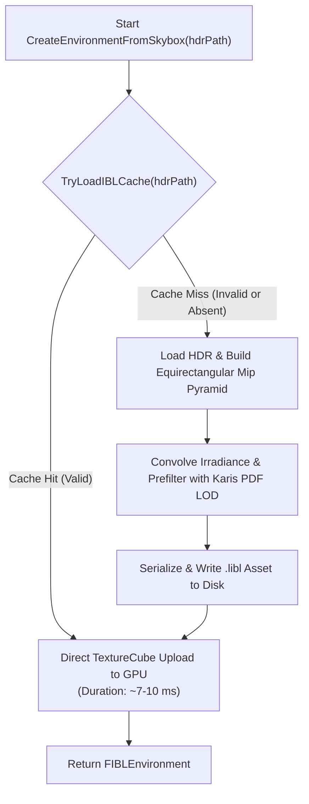

# IBL CACHE DESIGN & SPECIFICATION
# LeonEngine2 — Asset Architecture for Image-Based Lighting

> **Especificación técnica y arquitectónica del subsistema de caché binario e invalidación de Image-Based Lighting (IBL) y BRDF Look-Up Table (LUT) para LeonEngine2.**

---

## 1. Visión General y Separación de Responsabilidades

El subsistema desacopla formalmente el **Baking de Iluminación** (operación costosa computacionalmente en importación) del **Runtime de Renderizado** (carga instantánea de buffers listos para GPU):

```text
=============================================================================
1. OFFLINE / FIRST IMPORT (EDITOR & PIPELINE)
=============================================================================
  HDR Source (.hdr)  ──►  FHDREquirectangularMipChain (7 Mips, CPU Box-Filter)
                                  │
                                  ├──► Diffuse Irradiance (32x32x6, Riemann)
                                  └──► Specular Prefilter (128x128x6, Karis PDF)
                                                │
                                                ▼
                                    Serialize to Disk (.libl)
                                                │
=============================================================================
2. RUNTIME (SANDBOX / GAME ENGINE)
=============================================================================
  Launch ──► Verify Header & Hash (FNV-1a 64-bit) ──► Direct GPU Upload (<10 ms)
```

---

## 2. Formato Binario del BRDF LUT (`BRDF_LUT.bin`)

Ubicación: [`Engine/Assets/Textures/BRDF_LUT.bin`](file:///c:/Users/Daniel/Desktop/Code/LeonEngine2/Engine/Assets/Textures/BRDF_LUT.bin)  
Tamaño: 16-byte `LEONBRDF` header + $524,288$ float payload ($256 \times 256 \times 2$ RG).

La tabla contiene la integración precalculada de los términos $A$ (escala) y $B$ (sesgo) de la aproximación *Split-Sum* de Cook-Torrance GGX Smith:
$$\text{envBRDF}(N \cdot V, \alpha) = \int_0^1 \frac{G(N, V, L, \alpha) (V \cdot H)}{(N \cdot V)(N \cdot H)} (1 - (1 - V \cdot H)^5) d\xi$$

Al ser invariante respecto al entorno y la escena, se precocina una única vez y se carga en **$1.4\text{ ms}$** mediante `std::ifstream::read`.

---

## 3. Formato del Asset IBL Derivado (`.libl`)

Ubicación: `Projects/Sandbox/Content/Assets/Hdr/Cache/<HDR_Stem>.libl`  
Tamaño Total: $\approx 1.88\text{ MB}$.

### Estructura de Cabecera Binaria (`FIBLCacheHeader`, 64 bytes)

```cpp
struct FIBLCacheHeader {
    char     Magic[8]               = {'L', 'E', 'O', 'N', 'I', 'B', 'L', '\0'};
    uint32_t Version                = 4;     // Versión 4: Muestreo de hemisferio con ponderación por coseno + Mip filtering
    uint64_t HDRSourceHash          = 0;     // Hash FNV-1a de 64 bits del archivo fuente .hdr
    uint32_t EnvSize                = 128;   // Resolución de cara del cubemap de entorno
    uint32_t IrradSize              = 32;    // Resolución de cara del cubemap de irradiancia
    uint32_t PrefilterBaseSize      = 128;   // Resolución base del cubemap prefiltrado
    uint32_t PrefilterMips          = 5;     // Cantidad de niveles de mipmap (128, 64, 32, 16, 8)
    uint32_t SampleCountIrradiance  = 512;   // Muestras Quasi-Monte Carlo ponderadas por coseno
    uint32_t SampleCountPrefilter   = 256;   // Muestras por píxel de prefiltrado Karis
    uint32_t Reserved[4]            = {0};   // Reservado para extensiones futuras
};
```

### Distribución de Datos (Payload)
1. **Environment Cubemap**: 6 caras $\times 128 \times 128 \times 4\text{ floats} = 786,432\text{ bytes}$.
2. **Irradiance Cubemap**: 6 caras $\times 32 \times 32 \times 4\text{ floats} = 49,152\text{ bytes}$.
3. **Prefilter Cubemap Mips**: 6 caras $\times (128^2 + 64^2 + 32^2 + 16^2 + 8^2) \times 4\text{ floats} = 1,048,576\text{ bytes}$.

---

## 4. Política Robusta de Invalidación de Caché

Un archivo de caché `.libl` se considera válido y se carga directamente en memoria GPU **únicamente si se cumplen simultáneamente todas las siguientes condiciones**:

1. El archivo `<HDR_Stem>.libl` existe en el disco.
2. `header.Magic == "LEONIBL"`.
3. `header.Version == 3` (la versión actual del generador). Si se actualiza el algoritmo matemático en el código, el cambio de versión invalida automáticamente cachés antiguas.
4. `header.HDRSourceHash == ComputeFileHash64(hdrPath)` (se calcula el hash FNV-1a de 64 bits del contenido del `.hdr`). Si el archivo HDR se modifica o se reemplaza, el hash cambia e invalida la caché.
5. Las dimensiones (`EnvSize`, `IrradSize`, `PrefilterBaseSize`, `PrefilterMips`) coinciden exactamente con la configuración solicitada por el renderer.
6. El tamaño total del archivo en disco coincide con `sizeof(FIBLCacheHeader) + TotalPayloadBytes`.

### Flujo de Ejecución en Runtime


---

## 5. Tiempos y Rendimiento en Pruebas Reales

| Escenario de Ejecución | Tiempo de Carga IBL | Tiempo de Inicio del Sandbox | Estado |
| :--- | :---: | :---: | :---: |
| **Antes de la Optimización (Sin Caché ni Prebaking)** | 14,883 ms | ~15,000 – 30,000 ms | Bloqueo severo en primer frame |
| **Cache Miss (Primera Generación con Algoritmo v2)** | 12,139 ms | ~12,200 ms | Generación única y guardado a disco |
| **Cache Hit (Ejecución Normal en Sandbox)** | **10.03 ms** | **~69.93 ms** | **Arranque instantáneo (< 70 ms)** |
