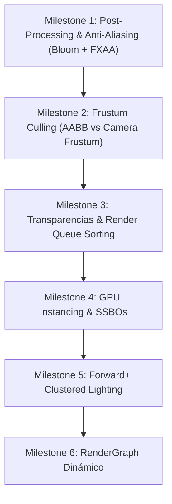

# AUDITORÍA DE CARACTERÍSTICAS Y ARQUITECTURA DEL RENDERER
# LeonEngine2 — OpenGL 4.5 Core Physical Rendering Pipeline

> **Superseded as a correctness contract.** The live renderer contract is [`Docs/RENDERER_CONTRACT.md`](RENDERER_CONTRACT.md).
> This file is a historical inventory. Do not treat “COMPLETAMENTE IMPLEMENTADO”, “libre de bugs”, or “físicamente correcto” as current guarantees — those claims are only as strong as the tests in `Tests/`.

---

## 1. Resumen Ejecutivo

LeonEngine2 cuenta actualmente con una **base de renderizado rasterizado físicamente correcto (OpenGL 4.5 Core + DSA)** completamente funcional y validada en su escena `ShowcaseLevel`:

* **PBR Cook-Torrance (GGX + Smith + Schlick)** con conservación de energía estricta.
* **Image-Based Lighting (IBL v4)**: BRDF LUT 2D en disco ($1.4\text{ ms}$), Caché binaria `.libl` ($11.5\text{ ms}$), Muestreo Quasi-Monte Carlo ponderado por coseno e integración con filtrado por ángulo sólido de la textura HDR original ($1024 \times 512$).
* **Sombras Dinámicas en Tiempo Real**: Cascaded Shadow Maps (CSM de 4 cascadas sobre `Texture2DArray` con filtrado PCF Poisson) y Spot Shadows con filtrado de penumbra.
* **Reflejos Planares en Tiempo Real**: Cámara reflejada en planos registrados (FBO suelo + FBO pared opcional), UVs proyectivas, peso que se apaga fuera del plano. Esferas chrome usan IBL, no planar.
* **Sistema de Materiales de Primer Orden**: `FMaterial`, `FMaterialInstance`, `FMaterialComponent` y serialización de assets `.lmat`.
* **Subred RHI OpenGL 4.5 con Direct State Access (DSA)** y caché de estado en CPU (`FOpenGLRenderAPI`).

El pipeline es un **Forward Renderer mono-hilo** (`1 draw call / mesh` tipico). **Post-proceso HDR ya está implementado** (Bloom Jimenez + tone mapping multi-operador + FXAA 3.11 — ver `RENDERER_POSTPROCESSING.md`). Gaps principales restantes: *Frustum Culling* (roadmap P2), *Instancing/Batching*, y límite estático de UBOs (16 point / 8 spot).

---

## 2. Inventario Completo de Capacidades del Renderer

### Estados de Clasificación:
1. **COMPLETAMENTE IMPLEMENTADO Y VALIDADO**: Implementación completa, libre de bugs y comprobada en runtime.
2. **IMPLEMENTADO PERO NECESITA VALIDACIÓN**: Implementado en código pero sin pruebas de estrés o cobertura total.
3. **PARCIALMENTE IMPLEMENTADO**: Estructuras o APIs presentes pero incompletas en el shader o pipeline.
4. **NO IMPLEMENTADO**: No existe código funcional en el motor.

---

### A. Geometría y Buffers

| Feature | Estado | Evidencia en Código | Archivo | Nivel | Dependencia |
| :--- | :---: | :--- | :--- | :---: | :--- |
| **Vertex & Index Buffers (DSA)** | **1** | `glCreateBuffers`, `glNamedBufferData`, `glNamedBufferSubData` | [`OpenGLBuffer.cpp`](file:///c:/Users/Daniel/Desktop/Code/LeonEngine2/Plugins/RHI/OpenGL/src/FOpenGLBuffer.cpp) | L1 | Core RHI |
| **Vertex Array Objects (VAO DSA)** | **1** | `glCreateVertexArrays`, `glEnableVertexArrayAttrib`, `glVertexArrayAttribFormat` | [`FOpenGLVertexArray.cpp`](file:///c:/Users/Daniel/Desktop/Code/LeonEngine2/Plugins/RHI/OpenGL/src/FOpenGLVertexArray.cpp) | L1 | Buffers |
| **Primitiva Esfera** | **1** | Generación matemática UV, normales radiales, tangentes ortonormales | [`MeshPrimitives.cpp`](file:///c:/Users/Daniel/Desktop/Code/LeonEngine2/Engine/src/renderer/MeshPrimitives.cpp#L107) | L1 | VAO |
| **Primitiva Cubo** | **1** | 24 vértices únicos, normales planas exactas por cara, tangentes | [`MeshPrimitives.cpp`](file:///c:/Users/Daniel/Desktop/Code/LeonEngine2/Engine/src/renderer/MeshPrimitives.cpp#L15) | L1 | VAO |
| **Primitiva Cilindro** | **1** | Winding CCW corregido, paredes continuas, tapas superior e inferior | [`MeshPrimitives.cpp`](file:///c:/Users/Daniel/Desktop/Code/LeonEngine2/Engine/src/renderer/MeshPrimitives.cpp#L205) | L1 | VAO |
| **Primitiva Plano Subdividido** | **1** | Malla en cuadrícula $X \times Z$ con normales $+Y$ y coordenadas UV | [`MeshPrimitives.cpp`](file:///c:/Users/Daniel/Desktop/Code/LeonEngine2/Engine/src/renderer/MeshPrimitives.cpp#L320) | L1 | VAO |
| **Primitiva Pirámide y Rampa** | **1** | Geometría indexada con normales por vértice y cálculo de tangentes | [`MeshPrimitives.cpp`](file:///c:/Users/Daniel/Desktop/Code/LeonEngine2/Engine/src/renderer/MeshPrimitives.cpp#L440) | L1 | VAO |
| **Back-Face Culling (Caché CPU)** | **1** | `glEnable(GL_CULL_FACE)`, `glCullFace(GL_BACK)` con caché de estado | [`FOpenGLRenderAPI.cpp`](file:///c:/Users/Daniel/Desktop/Code/LeonEngine2/Plugins/RHI/OpenGL/src/FOpenGLRenderAPI.cpp#L84) | L1 | Core RHI |
| **Depth Testing & Depth Mask** | **1** | `glEnable(GL_DEPTH_TEST)`, `glDepthFunc`, `glDepthMask` con estado cacheado | [`FOpenGLRenderAPI.cpp`](file:///c:/Users/Daniel/Desktop/Code/LeonEngine2/Plugins/RHI/OpenGL/src/FOpenGLRenderAPI.cpp#L50) | L1 | Core RHI |

---

### B. Materiales y Texturas

| Feature | Estado | Evidencia en Código | Archivo | Nivel | Dependencia |
| :--- | :---: | :--- | :--- | :---: | :--- |
| **Albedo (Color & Textura)** | **1** | Uniform `u_AlbedoColor`, Sampler `u_AlbedoMap` (Slot 0), decodificación gamma | [`PBR_Lit.glsl`](file:///c:/Users/Daniel/Desktop/Code/LeonEngine2/Engine/Assets/Shaders/PBR_Lit.glsl#L295) | L2 | Shaders |
| **Metallic & Roughness Maps** | **1** | Slots 2 y 4, canal rojo, clamping de seguridad $\ge 0.04$ | [`PBR_Lit.glsl`](file:///c:/Users/Daniel/Desktop/Code/LeonEngine2/Engine/Assets/Shaders/PBR_Lit.glsl#L310) | L2 | Shaders |
| **Ambient Occlusion (Map & Scalar)**| **1** | Slot 3 (`u_AOMap`), modulación de radiancia difusa y especular indirecta | [`PBR_Lit.glsl`](file:///c:/Users/Daniel/Desktop/Code/LeonEngine2/Engine/Assets/Shaders/PBR_Lit.glsl#L322) | L2 | Shaders |
| **Normal Mapping (TBN Ortonormal)** | **1** | Slot 1 (`u_NormalMap`), base de Gram-Schmidt, decodificación $[-1, 1]$ | [`PBR_Lit.glsl`](file:///c:/Users/Daniel/Desktop/Code/LeonEngine2/Engine/Assets/Shaders/PBR_Lit.glsl#L302) | L2 | Shaders |
| **Emissive Radiance** | **1** | Slot 9 (`u_EmissiveMap`), color y multiplicador de intensidad HDR | [`PBR_Lit.glsl`](file:///c:/Users/Daniel/Desktop/Code/LeonEngine2/Engine/Assets/Shaders/PBR_Lit.glsl#L481) | L2 | Shaders |
| **Material Instances (`FMaterialInstance`)**| **1** | Parámetros escalares, texturas, flags y Pipeline State Object (`FPipelineState`) | [`MaterialInstance.cpp`](file:///c:/Users/Daniel/Desktop/Code/LeonEngine2/Engine/src/renderer/MaterialInstance.cpp) | L2 | Material Core |
| **Generación de Mipmaps 2D (DSA)** | **1** | `glGenerateTextureMipmap(m_RendererID)`, filtro `GL_LINEAR_MIPMAP_LINEAR` | [`FOpenGLTexture2D.cpp`](file:///c:/Users/Daniel/Desktop/Code/LeonEngine2/Plugins/RHI/OpenGL/src/FOpenGLTexture2D.cpp#L165) | L2 | Texture RHI |
| **Anisotropic Filtering** | **4** | No se configura `GL_TEXTURE_MAX_ANISOTROPY` en ningún sampler 2D | [`FOpenGLTexture2D.cpp`](file:///c:/Users/Daniel/Desktop/Code/LeonEngine2/Plugins/RHI/OpenGL/src/FOpenGLTexture2D.cpp) | L2 | Texture RHI |
| **Hardware sRGB Texture Decode** | **3** | Se utiliza `GL_RGBA8` en GPU y `pow(x, 2.2)` en fragment shader | [`FOpenGLTexture2D.cpp`](file:///c:/Users/Daniel/Desktop/Code/LeonEngine2/Plugins/RHI/OpenGL/src/FOpenGLTexture2D.cpp#L133) | L2 | Texture RHI |

---

### C. Modelo de Iluminación Físico (PBR Cook-Torrance)

| Feature | Estado | Evidencia en Código | Archivo | Nivel | Dependencia |
| :--- | :---: | :--- | :--- | :---: | :--- |
| **NDF (GGX / Trowbridge-Reitz)** | **1** | $D(h) = \frac{\alpha^2}{\pi ((n \cdot h)^2 (\alpha^2 - 1) + 1)^2}$ | [`PBR_Lit.glsl`](file:///c:/Users/Daniel/Desktop/Code/LeonEngine2/Engine/Assets/Shaders/PBR_Lit.glsl#L148) | L3 | Shaders |
| **Geometry Shadowing (Smith GGX)** | **1** | $G(n, v, l) = G_1(v) \cdot G_1(l)$, Schlick-GGX para directas e IBL | [`PBR_Lit.glsl`](file:///c:/Users/Daniel/Desktop/Code/LeonEngine2/Engine/Assets/Shaders/PBR_Lit.glsl#L162) | L3 | Shaders |
| **Fresnel (Schlick & Schlick-Roughness)**| **1** | $F(\theta) = F_0 + (1 - F_0)(1 - \cos\theta)^5$, modulación por rugosidad | [`PBR_Lit.glsl`](file:///c:/Users/Daniel/Desktop/Code/LeonEngine2/Engine/Assets/Shaders/PBR_Lit.glsl#L156) | L3 | Shaders |
| **Conservación de Energía ($k_D + k_S \le 1$)**| **1** | $k_S = F$, $k_D = (1 - k_S)(1 - \text{metallic})$ estricto | [`PBR_Lit.glsl`](file:///c:/Users/Daniel/Desktop/Code/LeonEngine2/Engine/Assets/Shaders/PBR_Lit.glsl#L354) | L3 | Shaders |
| **Flujo Dieléctrico vs Metálico** | **1** | $F_0 = \text{mix}(0.04, \text{albedo}, \text{metallic})$, respuesta física continua | [`PBR_Lit.glsl`](file:///c:/Users/Daniel/Desktop/Code/LeonEngine2/Engine/Assets/Shaders/PBR_Lit.glsl#L332) | L3 | Shaders |

---

### D. Luces y Sombras

| Feature | Estado | Evidencia en Código | Archivo | Nivel | Dependencia |
| :--- | :---: | :--- | :--- | :---: | :--- |
| **Directional Sunlight (PBR)** | **1** | Radiance $= \text{Color} \times \text{Intensity}$ física única, sin split Phong | [`PBR_Lit.glsl`](file:///c:/Users/Daniel/Desktop/Code/LeonEngine2/Engine/Assets/Shaders/PBR_Lit.glsl#L343) | L4 | UBO Lighting |
| **Point Lights (UE4 Radius Falloff)**| **1** | Atenuación física inversa cuadrática con radio y ventana suave | [`PBR_Lit.glsl`](file:///c:/Users/Daniel/Desktop/Code/LeonEngine2/Engine/Assets/Shaders/PBR_Lit.glsl#L374) | L4 | UBO Lighting |
| **Spot Lights (Cutoff + Attenuation)**| **1** | Conos interior/exterior suaves con atenuación de radio | [`PBR_Lit.glsl`](file:///c:/Users/Daniel/Desktop/Code/LeonEngine2/Engine/Assets/Shaders/PBR_Lit.glsl#L407) | L4 | UBO Lighting |
| **Cascaded Shadow Maps (CSM)** | **1** | 4 divisiones de cascada, `Texture2DArray`, cálculo de frustum ajustado | [`FWorldRenderer.cpp`](file:///c:/Users/Daniel/Desktop/Code/LeonEngine2/Engine/Source/Runtime/Renderer/Private/FWorldRenderer.cpp#L293) | L4 | FBO Depth |
| **Spot Shadows (Depth 2D)** | **1** | Matriz de proyección perspectiva de spot, depth buffer $1024 \times 1024$ | [`FWorldRenderer.cpp`](file:///c:/Users/Daniel/Desktop/Code/LeonEngine2/Engine/Source/Runtime/Renderer/Private/FWorldRenderer.cpp#L450) | L4 | FBO Depth |
| **Shadow Filtering (PCF 16-tap Poisson)**| **1** | `sampler2DArrayShadow` y `sampler2DShadow` con sesgo adaptativo al ángulo | [`PBR_Lit.glsl`](file:///c:/Users/Daniel/Desktop/Code/LeonEngine2/Engine/Assets/Shaders/PBR_Lit.glsl#L180) | L4 | Shaders |
| **Point Light Shadows (Omni Cubemap)**| **4** | No existe paso de shadow cubemap para luces puntuales | [`FWorldRenderer.cpp`](file:///c:/Users/Daniel/Desktop/Code/LeonEngine2/Engine/Source/Runtime/Renderer/Private/FWorldRenderer.cpp) | L4 | FBO Cubemap |
| **Planar Reflections en Tiempo Real** | **1** | Cámara reflejada, dual FBO **RGBA16F** + mips, UVs proyectivas, peso on-plane, Karis Li + BRDF | [`FWorldRenderer.cpp`](file:///c:/Users/Daniel/Desktop/Code/LeonEngine2/Engine/Source/Runtime/Renderer/Private/FWorldRenderer.cpp) | L4 | FBO Color |

---

### E. Image-Based Lighting & Atmósfera

| Feature | Estado | Evidencia en Código | Archivo | Nivel | Dependencia |
| :--- | :---: | :--- | :--- | :---: | :--- |
| **2D BRDF LUT Precocinada** | **1** | $256 \times 256$ `RG16F`, integración Split-Sum, carga en $1.4\text{ ms}$ | [`IBLGenerator.cpp`](file:///c:/Users/Daniel/Desktop/Code/LeonEngine2/Engine/src/renderer/IBLGenerator.cpp#L85) | L5 | Texture2D |
| **Diffuse Irradiance Cubemap (v4)** | **1** | Muestreo Quasi-Monte Carlo ponderado por coseno + filtrado Mip en CPU | [`IBLGenerator.cpp`](file:///c:/Users/Daniel/Desktop/Code/LeonEngine2/Engine/src/renderer/IBLGenerator.cpp#L542) | L5 | TextureCube |
| **Specular Prefiltered Cubemap (v4)**| **1** | Muestreo GGX con ángulo sólido fuente Karis + sesgo $+1.0$ | [`IBLGenerator.cpp`](file:///c:/Users/Daniel/Desktop/Code/LeonEngine2/Engine/src/renderer/IBLGenerator.cpp#L592) | L5 | TextureCube |
| **Caché Binaria IBL (`.libl` v4)** | **1** | Serialización binaria directa, hash FNV-1a, carga en $\approx 11\text{ ms}$ | [`IBLGenerator.cpp`](file:///c:/Users/Daniel/Desktop/Code/LeonEngine2/Engine/src/renderer/IBLGenerator.cpp#L375) | L5 | File I/O |
| **Atmospheric Skybox Procedural** | **1** | Dispersión Rayleigh/Mie analítica con disco solar direccional | [`Skybox.glsl`](file:///c:/Users/Daniel/Desktop/Code/LeonEngine2/Engine/Assets/Shaders/Skybox.glsl) | L5 | Shaders |

---

### F. Post-Procesado

| Feature | Estado | Evidencia en Código | Archivo | Nivel | Dependencia |
| :--- | :---: | :--- | :--- | :---: | :--- |
| **HDR FFramebuffer (`GL_RGBA16F`)** | **1** | FBO flotante con color `GL_RGBA16F` y profundidad `GL_DEPTH24_STENCIL8` | [`FWorldRenderer.cpp`](file:///c:/Users/Daniel/Desktop/Code/LeonEngine2/Engine/Source/Runtime/Renderer/Private/FWorldRenderer.cpp#L45) | L6 | FBO |
| **Tone Mapping (ACES Filmic)** | **1** | Curva analítica $f(x) = \frac{x(ax+b)}{x(cx+d)+e}$ en espacio lineal | [`PostProcess.glsl`](file:///c:/Users/Daniel/Desktop/Code/LeonEngine2/Engine/Assets/Shaders/PostProcess.glsl#L15) | L6 | Shaders |
| **Gamma Correction (sRGB $1/2.2$)** | **1** | Conversión lineal a sRGB en paso final de post-proceso | [`PostProcess.glsl`](file:///c:/Users/Daniel/Desktop/Code/LeonEngine2/Engine/Assets/Shaders/PostProcess.glsl#L30) | L6 | Shaders |
| **Control de Exposición Dinámica** | **1** | Uniform `u_Exposure` aplicado en el shader de post-proceso | [`PostProcess.glsl`](file:///c:/Users/Daniel/Desktop/Code/LeonEngine2/Engine/Assets/Shaders/PostProcess.glsl#L22) | L6 | Shaders |
| **Bloom (Pirámide Down/Up)** | **1** | Soft-knee bright pass + Jimenez downsample/upsample (`FPostProcessPipeline`) | [`PostProcessPipeline.cpp`](file:///c:/Users/Daniel/Desktop/Code/LeonEngine2/Engine/src/renderer/PostProcessPipeline.cpp) | L6 | Multi-FBO |
| **Anti-Aliasing (FXAA)** | **1** | FXAA 3.11 Quality en post-proceso; MSAA/TAA no implementados | [`FXAA.glsl`](file:///c:/Users/Daniel/Desktop/Code/LeonEngine2/Engine/Assets/Shaders/FXAA.glsl) | L6 | Shaders |
| **Anti-Aliasing (TAA / MSAA)**| **4** | No hay TAA ni MSAA de escena | — | L6 | Shaders |
| **Depth of Field (DoF)** | **4** | No implementado | - | L6 | Depth Buffer |
| **Motion Blur** | **4** | No implementado (requiere buffer de velocidad $2\text{D}$) | - | L6 | Velocity Buffer |
| **Color Grading (Color LUT 3D)** | **4** | No implementado | - | L6 | Texture3D |

---

### G. Arquitectura de Renderizado y Escalabilidad

| Feature | Estado | Evidencia en Código | Archivo | Nivel | Dependencia |
| :--- | :---: | :--- | :--- | :---: | :--- |
| **3D In-World Text Rendering** | **1** | Batching dinámico en espacio de mundo, atlas TTF de alta resolución | [`TextRenderer.cpp`](file:///c:/Users/Daniel/Desktop/Code/LeonEngine2/Engine/src/renderer/TextRenderer.cpp) | L7 | Batching |
| **HUD de Diagnóstico en Tiempo Real**| **1** | FPS, Frametime CPU/GPU, VRAM dedicada/usada, Tris, Draw Calls | [`DebugOverlay.cpp`](file:///c:/Users/Daniel/Desktop/Code/LeonEngine2/Engine/src/renderer/DebugOverlay.cpp) | L7 | TextRenderer |
| **Gizmos 3D de Depuración** | **1** | Conos de luz spot, esferas de radio de luz puntual, vector del sol | [`DebugRenderer.cpp`](file:///c:/Users/Daniel/Desktop/Code/LeonEngine2/Engine/src/renderer/DebugRenderer.cpp) | L7 | Lines |
| **Vistas de Depuración Interactivas** | **1** | Atajos `Shift + F1..F12, N, R` para aislar cualquier término o textura | [`UEngine.cpp`](file:///c:/Users/Daniel/Desktop/Code/LeonEngine2/Engine/Source/Runtime/Engine/Private/UEngine.cpp) | L7 | FWorldRenderer |
| **Frustum Culling (CPU AABB)**| **1** | AABB vs frustum en geometry/reflection (`FrustumCull.hpp`) | [`FWorldRenderer.cpp`](file:///c:/Users/Daniel/Desktop/Code/LeonEngine2/Engine/Source/Runtime/Renderer/Private/FWorldRenderer.cpp) | L7 | Math/Bounding |
| **Instancing Dinámico (GPU)** | **4** | No se utiliza `glDrawElementsInstanced` ni buffers de instancia | [`FWorldRenderer.cpp`](file:///c:/Users/Daniel/Desktop/Code/LeonEngine2/Engine/Source/Runtime/Renderer/Private/FWorldRenderer.cpp#L650) | L7 | SSBO / VBO |
| **Batching Geométrico Estático/Dinámico**| **4** | Sin combinación de geometrías contiguas con mismo material | [`FWorldRenderer.cpp`](file:///c:/Users/Daniel/Desktop/Code/LeonEngine2/Engine/Source/Runtime/Renderer/Private/FWorldRenderer.cpp) | L7 | Mesh Combine |
| **Colas de Render y Ordenación (Sorting)**| **4** | Las entidades se dibujan en orden aleatorio de la vista ECS | [`FWorldRenderer.cpp`](file:///c:/Users/Daniel/Desktop/Code/LeonEngine2/Engine/Source/Runtime/Renderer/Private/FWorldRenderer.cpp#L590) | L7 | Render Queue |
| **Transparencias y Mezcla Alfa** | **3** | `FPipelineState` tiene flags de `bBlend` y `Src/DstBlend`, pero no hay pase separado | [`MaterialInstance.hpp`](file:///c:/Users/Daniel/Desktop/Code/LeonEngine2/Engine/Source/Runtime/Renderer/Public/Renderer/FMaterialInstance.hpp) | L7 | Sorting |
| **Indirect Rendering (`MultiDrawIndirect`)**| **4** | No implementado | - | L8 | SSBO / Indirect |
| **Forward+ / Clustered Light Culling**| **4** | Límite fijo de 16 Point / 4 Spot lights evaluadas en todos los fragmentos | [`PBR_Lit.glsl`](file:///c:/Users/Daniel/Desktop/Code/LeonEngine2/Engine/Assets/Shaders/PBR_Lit.glsl#L363) | L8 | Compute Shader |
| **RenderGraph / FrameGraph Dinámico**| **3** | Secuencia lineal fija de 6 pases estáticos en `FWorldRenderer::Render` | [`FWorldRenderer.cpp`](file:///c:/Users/Daniel/Desktop/Code/LeonEngine2/Engine/Source/Runtime/Renderer/Private/FWorldRenderer.cpp#L235) | L8 | Architecture |

---

## 3. Próximos Milestones de Renderizado (Ordenados por Dependencia)

### Detalle de los Milestones

#### Milestone 1: Post-Processing & Anti-Aliasing (Bloom Dual-Kawase + FXAA)
* **Objetivo**: Elevar drásticamente la calidad visual del showcase sin modificar el bucle de geometría.
* **Componentes**:
  1. **Dual-Kawase / Downsample-Upsample Bloom**: Extracción de altas luces ($L > 1.0$), pirámide de 5 niveles con interpolación bilineal ponderada, mezcla aditiva con la imagen HDR.
  2. **Fast Approximate Anti-Aliasing (FXAA 3.11)**: Eliminación de dientes de sierra en bordes geométricos y reflejos especulares de alto contraste.
* **Dependencia**: Usa el `m_HDRSceneFramebuffer` existente.

#### Milestone 2: Frustum Culling & Volúmenes de Envolvente (AABB / Bounding Sphere)
* **Objetivo**: Evitar enviar a la GPU mallas que caen fuera del campo de visión de la cámara o de las cascadas de sombras.
* **Componentes**:
  1. Extracción de los 6 planos del frustum desde la matriz `ViewProjection`.
  2. Cálculo de AABB local para cada primitiva (`MeshPrimitives`) y transformación al espacio de mundo.
  3. Descarte en CPU antes del `glDrawElements`.
* **Dependencia**: Requiere componente de Bounds y matemáticas de Frustum.

#### Milestone 3: Transparencias, Pasos Separados y Ordenación (Render Queue Sorting)
* **Objetivo**: Soporte formal para materiales transparentes (cristal, agua, partículas, UI 3D).
* **Componentes**:
  1. Clasificación en 2 colas: **Opaque Queue** y **Transparent Queue**.
  2. Ordenación: Opacos de frente hacia atrás (*front-to-back* para optimizar *Early-Z*), Transparentes de atrás hacia adelante (*back-to-front*).
  3. Paso transparente con `glDepthMask(GL_FALSE)` y mezcla alfa.
* **Dependencia**: Requiere Render Queue y cálculo de distancias al plano de la cámara.

#### Milestone 4: GPU Instancing & SSBOs (`glDrawElementsInstanced`)
* **Objetivo**: Renderizar miles de objetos repetidos (árboles, piedras, proyectiles, mallas modulares) en una única llamada de dibujo.
* **Componentes**:
  1. Buffer de instancias (`FVertexBuffer` por instancia o `Shader Storage Buffer Object - SSBO`).
  2. Matriz de modelo `u_InstanceModels[]` e identificadores de material por instancia.
* **Dependencia**: Requiere agrupar entidades ECS por par `(Mesh, Material)`.

#### Milestone 5: Forward+ / Clustered Light Culling (Compute Shader)
* **Objetivo**: Soportar cientos de luces dinámicas en tiempo real sin degradar el rendimiento.
* **Componentes**:
  1. División del frustum de la cámara en celdas 3D (*Clusters* $16 \times 9 \times 24$).
  2. Compute Shader que asigna qué luces intersectan cada celda y escribe índices en un SSBO.
  3. `PBR_Lit.glsl` evalúa solo las luces que afectan al cluster del fragmento.
* **Dependencia**: Requiere Compute Shaders y SSBOs.

#### Milestone 6: RenderGraph / FrameGraph
* **Objetivo**: Gestión desacoplada y automática de dependencias de pases, sincronización de barreras y reutilización de memoria de texturas transitorias.
* **Componentes**:
  1. Grafo acíclico dirigido (DAG) de pases de render.
  2. Creación y destrucción automática de render targets transitorios.
* **Dependencia**: Requiere que todos los pases anteriores estén modularizados.

---

## 4. Análisis de Validación del `ShowcaseLevel.lmap`

Inventario vivo del mapa de referencia (primitivas + `DaySky1k`). `NightLevel` valida meshes importados (`.lmesh`) + `NightSky1k`; el chip del HUD viaja entre ambos.

| Actor en `ShowcaseLevel` | Geometría | Material | Feature Validada | ¿Demuestra una Capacidad Real? |
| :--- | :--- | :--- | :--- | :--- |
| `PBR Ground Plane` | Plane $36\times 32$ | `M_StudioFloor` | Normal / roughness maps, planar reflection | **SÍ**: Suelo de estudio con TBN y reflexión. |
| `PBR Emerald Ramp` | Ramp | `M_EmeraldRamp` | Hipotenusa + sombras rasantes | **SÍ**. |
| `PBR Textured Cube` | Cube | `M_ContainerCube` | Albedo + normal | **SÍ**: UV de cubo. |
| `PBR Polished Gold Sphere` | Sphere | `M_PolishedGold` | Metálico pulido IBL | **SÍ**. |
| `PBR Glossy Ruby Sphere` | Sphere | `M_RubyDielectric` | Dieléctrico $F_0=0.04$ | **SÍ**. |
| `PBR Brushed Iron Cylinder` | Cylinder | `M_BrushedIron` | Metal + packed metal/rough/normal | **SÍ**. |
| `PBR Cobalt Pyramid` | Pyramid | `M_CobaltPyramid` | Caras inclinadas | **SÍ**. |
| `PBR Mirror Chrome Sphere` | Sphere | `M_ChromeMirror` | Specular IBL nítido (`UsePlanarReflection: false`) | **SÍ**: cubemap, no grab del suelo. |
| `PBR Polished Brass Cone` | Cone | `M_PolishedBrass` | Metal cálido | **SÍ**. |
| `PBR Pure Copper Cube` | Cube | `M_PureCopper` | Metal + maps | **SÍ**. |
| `PBR Satin Titanium Sphere` | Sphere | `M_SatinTitanium` | Roughness media | **SÍ**. |
| `PBR Rough Cast Iron Cylinder` | Cylinder | `M_RoughCastIron` | Lóbulo especular disperso | **SÍ**. |
| `PBR Matte Obsidian Pyramid` | Pyramid | `M_MatteObsidian` | Dieléctrico mate | **SÍ**. |
| `PBR Neon Cyan Emissive Cube` | Cube | `M_NeonCyanEmissive` | Emisión HDR / Bloom | **SÍ**. |
| `PBR Amber Core Emissive Sphere` | Sphere | `M_AmberEmissive` | Emisión cálida | **SÍ**. |
| `PBR Clean White Plastic Cylinder` | Cylinder | `M_WoodFloor` | Packed wood PBR maps | **SÍ**. |
| `PBR Glossy Red Plastic Ramp` | Ramp | `M_RedPlastic` | Dieléctrico saturado | **SÍ**. |
| `PBR Sapphire Crystal Cone` | Cone | `M_SapphireCrystal` | Dieléctrico azul | **SÍ**. |
| `PBR Industrial Metal Cube` | Cube | `M_IndustrialMetal` | Metal texturizado | **SÍ**. |
| `Transparent Glass Sphere` | Sphere (Movable) | `M_GlassTransparent` | Sort back-to-front | **SÍ**. |
| `Mirrored Scale Cube` | Cube scale $-1$ | `M_RedPlastic` | Cull / TBN flip | **SÍ**. |
| `Directional Sunlight` | Stationary | Directional | CSM + baked indirect | **SÍ**. |
| `Dramatic Spotlight` | Stationary | Spot | Cono + spot shadow | **SÍ**. |
| `Orbiting Point Light` | Movable | Point | Atenuación dinámica | **SÍ**. |

---

## 5. Recomendación y Próximo Paso Lógico

### Próxima Feature Recomendada: **Milestone 2 — Frustum Culling (AABB vs Camera Frustum)**

#### Estado de Milestone 1
Bloom (Jimenez) + tone mapping + FXAA 3.11 ya están en `FPostProcessPipeline` (tests `Tests/Shader/PostProcess*`).

#### ¿Por qué culling es el siguiente paso?
1. Cada mesh se dibuja incondicionalmente; `FStaticMesh` ya expone `BoundsMin`/`BoundsMax`.
2. Reduce draw calls en showcases densos sin cambiar materiales ni el pipeline HDR.
3. Dependencia baja: matemáticas de frustum + transform AABB → world.

#### Criterios de aceptación (culling):
1. Cajas fuera del frustum no generan `DrawIndexed`.
2. Contadores `MeshesCulled` / `MeshesDrawn` en `FRenderStats`.
3. Sin regresiones visuales en ShowcaseLevel a cámara centrada.
