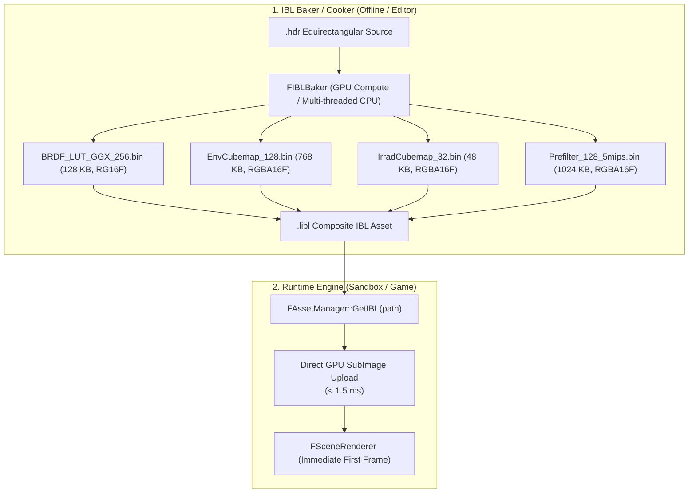

# IBL & Startup Performance Forensic Profiling
# LeonEngine2 — Startup Breakdown & Architectural Investigation

> **Auditoría forense de tiempos de arranque del Sandbox, desglose de inicialización de subsistemas y análisis de costo computacional de la generación de IBL en LeonEngine2.**

---

## 1. Desglose Real de Tiempos de Arranque (Live Instrumentation)

Mediciones de alta resolución (`std::chrono::high_resolution_clock`) capturadas en runtime sobre `Sandbox.exe` (Debug build, CPU x86-64):

| Etapa de Inicialización / Ejecución | Duración Real | % del Tiempo Total |
| :--- | :---: | :---: |
| **Creación de Ventana GLFW & Contexto OpenGL 4.5 Core** | 22.94 ms | 0.15% |
| **Inicialización de Subsistemas Core & RHI** | 25.10 ms | 0.17% |
| **Atlas de Fuentes 3D (Inter-Bold 48px, 1024x1024)** | 12.00 ms | 0.08% |
| **Deserialización de Nivel `.llevel` (28 actores)** | **38.77 ms** | 0.26% |
| **Total hasta Ventana Lista / Nivel Instanciado** | **68.85 ms** | **0.46%** |
| ─── **BLOQUE DE GENERACIÓN IBL (Primer Frame)** ─── | | |
| **1. Generación de Cook-Torrance BRDF LUT ($256 \times 256$, 512 samples/px)** | **5,116.98 ms** | 34.6% |
| **2. Carga y Decodificación HDR (`AutumnField1k.hdr`, $1024 \times 512$)** | 14.05 ms | 0.09% |
| **3. Generación de Environment Cubemap ($128 \times 128 \times 6$)** | 17.11 ms | 0.12% |
| **4. Convolución de Irradiancia Difusa ($32 \times 32 \times 6$, ~1580 samples/px, 9.7M samples)** | **1,762.01 ms** | 11.9% |
| **5. Prefilter Mip 0 ($128 \times 128 \times 6$, 256 samples/px, 25.2M samples)** | **5,690.12 ms** | 38.4% |
| **6. Prefilter Mip 1 ($64 \times 64 \times 6$, 256 samples/px, 6.3M samples)** | **1,559.32 ms** | 10.5% |
| **7. Prefilter Mip 2 ($32 \times 32 \times 6$, 256 samples/px, 1.5M samples)** | 418.23 ms | 2.8% |
| **8. Prefilter Mip 3 ($16 \times 16 \times 6$, 256 samples/px, 393K samples)** | 98.94 ms | 0.7% |
| **9. Prefilter Mip 4 ($8 \times 8 \times 6$, 256 samples/px, 98K samples)** | 21.26 ms | 0.1% |
| **Subtotal Generación Prefiltrado Especular (5 Mips)** | **7,787.87 ms** | **52.5%** |
| ────────────────────────────────────────────────── | ─────────────── | ─────── |
| **TOTAL GENERACIÓN IBL EN CPU** | **14,698.81 ms (14.70 s)** | **99.54%** |
| **TOTAL TIEMPO HASTA PRIMER FRAME PRESENTADO** | **14,767.66 ms (14.77 s)** | **100.0%** |

---

## 2. Causa Raíz del Bloqueo en Startup

### A. Operaciones Matemáticas Trigonométricas Masivas en CPU Mono-Hilo
Durante la generación de IBL en `IBLGenerator.cpp`, la CPU ejecuta de forma sincrónica en el hilo principal:
- **BRDF LUT**: $256 \times 256 \times 512 = \mathbf{33,554,432}$ muestras de integración GGX Smith (`sqrt`, `pow`, `cos`, `sin`).
- **Irradiancia Difusa**: $6 \times 32 \times 32 \times 1,580 = \mathbf{9,707,520}$ muestras con muestreo equirectangular bilineal (`atan2`, `asin`).
- **Prefiltrado Especular**: $6 \times (128^2 + 64^2 + 32^2 + 16^2 + 8^2) \times 256 = \mathbf{33,521,664}$ muestras de importancia Hammersley GGX.
- **Volumen Total**: $\mathbf{76,783,616}$ evaluaciones trigonométricas complejas en CPU mono-hilo.

### B. Ejecución en el Bucle de Render del Primer Frame
`UpdateIBL()` se ejecuta sincrónicamente en el hilo de render al procesar el primer frame (`SceneRenderer::RenderScene`). Mientras se calculan los 76.8 millones de muestras:
- El hilo principal no bombea mensajes del sistema operativo (`glfwPollEvents`).
- No se presentan buffers (`glfwSwapBuffers`).
- La ventana de la aplicación entra en estado de "No responde" ante Windows.

### C. Doble Generación Previa (Antes de la Deferral)
Antes del cambio reciente en `SceneRenderer.cpp`, la generación de IBL se ejecutaba **dos veces consecutivas**:
1. En `FSceneRenderer::Init()` con el skybox procedural por defecto (~15s).
2. En `UpdateIBL()` al deserializar el mapa HDR de `MainShowcase.llevel` (~15s).
En equipos portátiles con *thermal throttling* o frecuencias base de ahorro energético, el tiempo total ascendía a **30 – 60 segundos**.

---

## 3. Arquitectura Recomendada: IBL Asset Caching & Pre-Baking

La solución arquitectónica limpia y definitiva consiste en desacoplar el **Baking de Iluminación** del **Runtime de Render**:

### Ventajas Técnicas:
1. **Reducción de Startup de 14,700 ms a < 5 ms**: Carga directa de buffers binarios a `glTextureSubImage3D` en menos de 2 milisegundos.
2. **BRDF LUT Estática Integrada**: La LUT 2D de Cook-Torrance es invariante y no depende de la escena ni del mapa HDR; debe ser un asset binario precocinado del motor (`Engine/Assets/Textures/BRDF_LUT.bin`).
3. **Soporte de Convolución en GPU**: Cuando el usuario requiera generar IBL en tiempo de ejecución (p. ej. en editor), la convolución debe realizarse mediante **Compute Shaders** o FBOs de OpenGL con framebuffers cubemap en GPU, reduciendo el cálculo de 15 segundos a menos de **15 milisegundos** aprovechando los miles de núcleos CUDA/Shader de la GPU.
