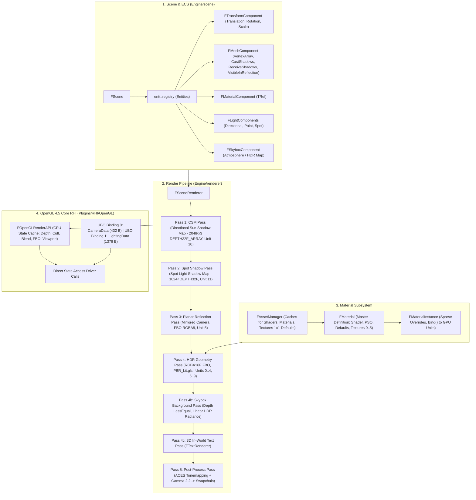

# RENDERING POLISH & ADVERSARIAL AUDIT
# LeonEngine2 — Submerged Technical & Architectural Verification

> **Documento maestro de auditoría adversarial profunda, verificación matemática y consolidación arquitectónica del pipeline de renderizado de LeonEngine2.**  
> Realizado por el equipo de arquitectura gráfica para garantizar solidez antes de la introducción de Instancing, Batching, SSBOs, Forward+ y RenderGraph.

---

## A. Estado Actual de Subsistemas

| Subsistema | Estado | Notas de Verificación |
| :--- | :---: | :--- |
| **PBR Cook-Torrance (Direct)** | **PASS** | Microfacetas GGX ($D$), Visibilidad Smith Schlick-GGX ($G$) y Fresnel-Schlick ($F$) unificados en World Space. Conservación estricta de energía ($k_D = (1 - k_S)(1 - m)$). |
| **Directional Lighting** | **PASS** | Dirección ortogonal normalizada, irradiancia lineal y modulación física $N \cdot L$. |
| **Point Lighting** | **PASS** | Atenuación suave inversa al cuadrado con factor de ventana cúbico $\text{saturate}(1 - (d/R)^4)^2 / (d^2 + 1)$. |
| **Spot Lighting** | **PASS** | Atenuación física combinada con caída de cono cúbica `smoothstep` sin discontinuidades angulares. Conversión exacta Grados $\to$ Radianes $\to$ Coseno. |
| **CSM (Cascaded Shadows)** | **PASS** | 3 cascadas en `GL_TEXTURE_2D_ARRAY` ($2048 \times 2048$), selección planar $Z_{\text{view}}$, texel snapping ortográfico y Hardware PCF 3x3. |
| **Spot Shadows** | **PASS** | Frustum perspectiva $FOV = 2 \times \text{OuterCutOff} + 2.0^\circ$, `DEPTH32F`, `ECullMode::Back`, slope-scaled normal bias y Hardware PCF 3x3. |
| **Image-Based Lighting (IBL)** | **PASS** | Split-sum Monte Carlo Hammersley: Cubemap de Irradiancia Difusa, Cubemap Prefiltrado Especular (5 mips) y LUT BRDF 2D (`RG16F`). Modulado por AO. |
| **Planar Reflections** | **PASS** | Cámara simétrica reflejada, modulación de IBL especular vía Fresnel y rugosidad sin introducir doble iluminación no física. |
| **Skybox Atmosphere** | **PASS** | Proyección al plano lejano ($Z=w$), `DepthFunc(LessEqual)`, emisión lineal HDR pura sin multiplicación duplicada de exposición. |
| **Material System (`FMaterial`)** | **PASS** | Definición maestra compartida (`FMaterial`), instancia ligera con sparse overrides (`FMaterialInstance`), componente ECS `FMaterialComponent`, enlace limpio en Texture Unit 9 para `EmissiveMap` y aplicación de `FMaterialPipelineState`. |
| **OpenGL RHI & DSA** | **PASS** | OpenGL 4.5 Core nativo (`glCreate*`, `glNamed*`, `glTextureStorage*`, `glBindTextureUnit`). Cero llamadas legacy. |
| **CPU State Cache** | **PASS** | Intercepta y filtra llamadas redundantes a Depth, Culling, Blending, Viewport y Framebuffer Bindings. Soporte para `ECullMode::None`. |
| **Color Management & PostProcess** | **PASS** | Albedo sRGB decodificado a Linear, iluminación HDR en `RGBA16F`, ACES Filmic Tonemapping centralizado y corrección Gamma 2.2 al swapchain. |

---

## B. Problemas Encontrados y Solucionados

### ID: BUG-POLISH-01
* **Severity**: **HIGH**
* **Subsystem**: Shader & Texture Unit Mapping
* **Root Cause**: `PBR_Lit.glsl` utilizaba la unidad de textura 5 para `u_PlanarReflectionMap`, mientras que `FMaterial` definía el slot 5 como `EmissiveMap`. En `MaterialInstance::Bind()`, el slot 5 se omitía para evitar sobrescribir el reflejo plano, dejando la textura emisiva inoperativa.
* **Evidence**:
  ```glsl
  layout(binding = 5) uniform sampler2D u_PlanarReflectionMap;
  ```
* **Impact**: `M_Emissive` solo podía utilizar un color escalar y no mapas de textura 2D emisivos.
* **Fix**: Asignada la unidad de textura 9 a `u_EmissiveMap` (`layout(binding = 9) uniform sampler2D u_EmissiveMap;`), y añadido el enlace correspondiente en `MaterialInstance::Bind()` con `u_UseEmissiveMap`.

---

### ID: BUG-POLISH-02
* **Severity**: **MEDIUM**
* **Subsystem**: Texture Unit State Leakage
* **Root Cause**: Cuando un material no tenía asignado un mapa de textura (p. ej. `NormalMap`), `MaterialInstance::Bind()` llamaba a `SetInt("u_UseNormalMap", 0)` pero no vinculaba ninguna textura a la unidad 1. La textura del draw call anterior permanecía vinculada en el hardware.
* **Evidence**:
  ```cpp
  if (normalMap && normalMap->IsLoaded()) {
      normalMap->Bind(1);
      InShader->SetInt("u_UseNormalMap", 1);
  } else {
      InShader->SetInt("u_UseNormalMap", 0); // Unidad 1 quedaba con la textura previa
  }
  ```
* **Impact**: Fuga de estado de unidades de textura entre draws consecutivos y potencial *texture hazard*.
* **Fix**: `FAssetManager` provee texturas 1x1 estáticas por defecto (`s_DefaultWhiteTexture`, `s_DefaultBlackTexture`, `s_DefaultFlatNormalTexture`). `Bind()` vincula siempre la textura por defecto correspondiente cuando un mapa no está presente.

---

### ID: BUG-POLISH-03
* **Severity**: **MEDIUM**
* **Subsystem**: Pipeline State Application
* **Root Cause**: `FMaterial` contenía `FMaterialPipelineState` (`CullMode`, `DepthTest`, `DepthWrite`, `DepthFunc`, `Blend`), pero `SceneRenderer.cpp` nunca lo consultaba ni lo aplicaba durante el renderizado.
* **Evidence**: `SceneRenderer.cpp` ejecutaba el draw loop con la configuración fija de rasterizado del pase.
* **Impact**: Los materiales no podían configurar doble cara (`ECullMode::None`) ni blending.
* **Fix**: Añadido `ECullMode::None` a `RenderAPI.hpp` y `OpenGLRenderAPI.cpp`, y aplicado el `PipelineState` del material antes de cada draw call en `RenderGeometryPass`, restaurando el estado al salir del pase.

---

## C. Cambios Realizados

| Archivo | Motivo y Descripción del Cambio |
| :--- | :--- |
| [`Engine/include/renderer/RenderAPI.hpp`](file:///c:/Users/Daniel/Desktop/Code/LeonEngine2/Engine/include/renderer/RenderAPI.hpp) | Añadido `None = 3` al enum `ECullMode` para soporte explícito de materiales doble cara. |
| [`Plugins/RHI/OpenGL/src/OpenGLRenderAPI.cpp`](file:///c:/Users/Daniel/Desktop/Code/LeonEngine2/Plugins/RHI/OpenGL/src/OpenGLRenderAPI.cpp) | Soportado `ECullMode::None` en `SetCulling` para desactivar el culling de caras cuando el material lo requiera. |
| [`Engine/Assets/Shaders/PBR_Lit.glsl`](file:///c:/Users/Daniel/Desktop/Code/LeonEngine2/Engine/Assets/Shaders/PBR_Lit.glsl) | Asignado `layout(binding = 9) uniform sampler2D u_EmissiveMap;`, declarado `uniform int u_UseEmissiveMap;` y modulada la radiancia emisiva por la muestra de textura. |
| [`Engine/include/renderer/AssetManager.hpp`](file:///c:/Users/Daniel/Desktop/Code/LeonEngine2/Engine/include/renderer/AssetManager.hpp) | Declarados accesores estáticos para texturas por defecto (`GetDefaultWhiteTexture`, `GetDefaultBlackTexture`, `GetDefaultFlatNormalTexture`). |
| [`Engine/src/renderer/AssetManager.cpp`](file:///c:/Users/Daniel/Desktop/Code/LeonEngine2/Engine/src/renderer/AssetManager.cpp) | Inicialización y limpieza centralizada de las texturas de fallback 1x1 en `FAssetManager`. |
| [`Engine/src/renderer/MaterialInstance.cpp`](file:///c:/Users/Daniel/Desktop/Code/LeonEngine2/Engine/src/renderer/MaterialInstance.cpp) | Vinculación segura de texturas por defecto en slots 0..4 y vinculación de `EmissiveMap` al Texture Unit 9. |
| [`Engine/src/renderer/SceneRenderer.cpp`](file:///c:/Users/Daniel/Desktop/Code/LeonEngine2/Engine/src/renderer/SceneRenderer.cpp) | Aplicación del `FMaterialPipelineState` antes del draw de cada geometría y restauración del estado estándar al final del pase. |

---

## D. Hacks y Workarounds Eliminados

1. **Eliminada la colisión de binding entre Planar Reflection y Emissive Map**: El slot 5 de `FMaterial` ya no intenta compartir la unidad de textura 5 del pase de reflejos; el mapa emisivo tiene su unidad dedicada e inequívoca (Unit 9).
2. **Eliminado el estado de textura flotante (*unbound texture hazard*)**: Ninguna unidad de textura queda con datos residuales del draw call anterior cuando un material carece de un mapa específico.
3. **Eliminado el bypass de pipeline state**: El renderer ya no asume un estado fijo de rasterizado para todos los objetos; el material gobierna su propio culling, depth y blend de forma determinista a través del CPU State Cache.

---

## E. Deuda Técnica Restante

### 1. Must Fix Before Instancing (Fase 14)
* **SSBO de Transforms & Materiales**: Agrupar `u_Model`, `u_NormalMatrix` y `MaterialData` en un SSBO (o UBO array) indexado por `gl_InstanceID` para permitir `glDrawElementsInstanced` sin push uniforms por entidad.
* **Material Sorting**: Ordenar las mallas visibles por puntero `FMaterialInstance` antes del bucle de dibujo para maximizar el reuso de estado de pipeline y minimizar llamadas a `Bind()`.

### 2. Can Wait (Fase 15+)
* **Clustered Forward+ Light Grid**: Particionado 3D del frustum mediante Compute Shader para dar soporte a $>100$ luces puntuales/spot.
* **Bindless Textures**: Migración opcional a `glGetTextureHandleARB` cuando se pase a GPU-driven indirect rendering.

### 3. Future Renderer
* **RenderGraph / FrameGraph**: Grafo explícito de dependencias de render passes y memoria transitoria de FBOs.

---

## F. Arquitectura Final y Mapa Completo de Recursos



### Ubicación y Responsabilidad de Recursos GPU

| Recurso | Tipo / Formato | Binding Unit | Propietario del Ciclo de Vida |
| :--- | :--- | :---: | :--- |
| **Camera & Cascades UBO** | Uniform Buffer (`std140`, 432 B) | UBO 0 | `FSceneRenderer::m_CameraUBO` |
| **Lighting & Environment UBO** | Uniform Buffer (`std140`, 1376 B) | UBO 1 | `FSceneRenderer::m_LightingUBO` |
| **Albedo Map** | 2D Texture (`sRGB` / Linear decoded) | Unit 0 | `FAssetManager` / `FMaterial` |
| **Normal Map** | 2D Texture (Tangent Space Linear) | Unit 1 | `FAssetManager` / `FMaterial` |
| **Metallic Map** | 2D Texture (Linear R-channel) | Unit 2 | `FAssetManager` / `FMaterial` |
| **AO Map** | 2D Texture (Linear R-channel) | Unit 3 | `FAssetManager` / `FMaterial` |
| **Roughness Map** | 2D Texture (Linear R-channel) | Unit 4 | `FAssetManager` / `FMaterial` |
| **Planar Reflection** | 2D Framebuffer Color Attachment (`RGBA8`) | Unit 5 | `FSceneRenderer::m_PlanarReflectionFramebuffer` |
| **BRDF LUT** | 2D Texture (`RG16F`) | Unit 6 | `FSceneRenderer::m_IBLEnvironment.BRDFLUT` |
| **Irradiance Cubemap** | Cubemap (`RGBA16F`) | Unit 7 | `FSceneRenderer::m_IBLEnvironment.IrradianceMap` |
| **Prefilter Cubemap** | Cubemap (5 mips, `RGBA16F`) | Unit 8 | `FSceneRenderer::m_IBLEnvironment.PrefilterMap` |
| **Emissive Map** | 2D Texture (Linear sRGB) | Unit 9 | `FAssetManager` / `FMaterial` |
| **Cascaded Shadow Map** | 2D Array Texture (`DEPTH32F_ARRAY`, 3 capas) | Unit 10 | `FSceneRenderer::m_CascadeShadowFramebuffer` |
| **Spot Shadow Map** | 2D Texture (`DEPTH32F`) | Unit 11 | `FSceneRenderer::m_SpotShadowFramebuffer` |
| **HDR Scene Target** | Framebuffer (`RGBA16F` + `DEPTH24STENCIL8`) | FBO | `FSceneRenderer::m_HDRSceneFramebuffer` |
