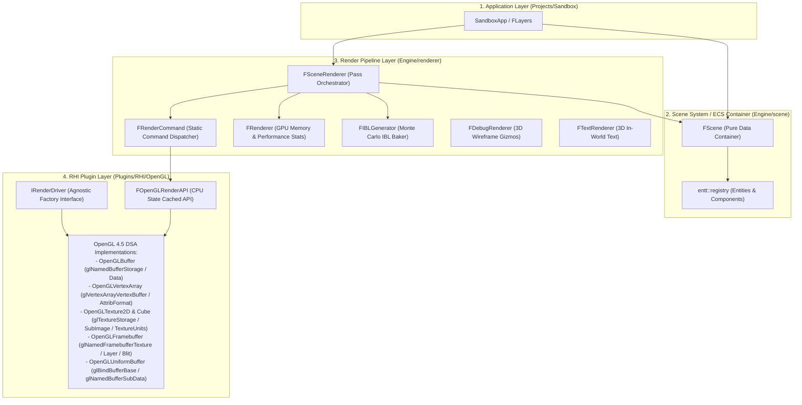
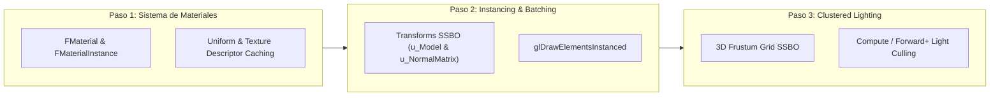

# RENDER AUDIT & ARQUITECTURA DEL SUBSISTEMA DE RENDERIZADO
# LeonEngine2 (OpenGL 4.5 Core DSA + PBR Pipeline)

> **Documento maestro de arquitectura, auditoría técnica, catálogo de características, matemáticas de iluminación y resolución de problemas del subsistema gráfico 3D de LeonEngine2.**  
> Estado del código consolidado tras las Fases 1 a 12, el pulido técnico profundo y la validación matemática/física de Spot Lights y sombras.

---

## 1. Arquitectura General y Flujo de Datos

LeonEngine2 implementa una arquitectura desacoplada y modular inspirada en motores de nueva generación (Unreal Engine / Filament), dividida en 4 capas estrictas con responsabilidades explícitas:



---

## 2. Catálogo de Características y Funcionamiento Técnico

### 2.1 RHI Moderno en OpenGL 4.5 Core con Direct State Access (DSA)
- **Eliminación de llamadas legacy**: No se utiliza `glBindBuffer`, `glBindTexture`, `glTexImage2D` ni `glBindFramebuffer` para configuración de recursos.
- **Almacenamiento Inmutable (`glNamedBufferStorage`, `glTextureStorage2D/3D`)**: Se asigna memoria GPU de tamaño fijo e inmutable en inicialización, previniendo fragmentación de memoria del driver.
- **Direct Texture Units (`glBindTextureUnit`)**: Enlaza texturas directamente a unidades de textura (0..N) sin necesidad de modificar el estado global con `glActiveTexture`.
- **VRAM Tracking Simétrico**: Todas las asignaciones y liberaciones de memoria en GPU notifican a `FRenderer::OnGPUAlloc` y `FRenderer::OnGPUFree`, permitiendo un seguimiento en tiempo real del uso de VRAM desde el HUD de depuración.

### 2.2 CPU State Caching en `FOpenGLRenderAPI`
- **Filtrado de llamadas redundantes**: Mantiene un registro en CPU de los estados activos (`m_DepthTestEnabled`, `m_DepthMaskEnabled`, `m_DepthFunc`, `m_CullEnabled`, `m_CullMode`, `m_BlendEnabled`, `m_SrcBlend`, `m_DstBlend`, `m_CurrentFBO`, `m_ViewportX/Y/W/H`).
- **Sincronización Total con Framebuffers**: Todas las operaciones de `FFramebuffer::Bind()` y `Unbind()` se enrutan a través de `FRenderCommand::BindFramebuffer` y `FRenderCommand::SetViewport`, garantizando que el State Cache nunca quede desfasado respecto al driver.
- **Seamless Cubemaps**: Activación global de `GL_TEXTURE_CUBE_MAP_SEAMLESS` en inicialización para evitar artefactos de costuras en los bordes de los cubemaps de IBL.

### 2.3 Modelo Físico PBR de Iluminación Directa
- **Cook-Torrance Microfacet BRDF**:
  - **Distribución Normal (NDF)**: Trowbridge-Reitz GGX ($D(H)$).
  - **Visibilidad / Geometría ($G$)**: Smith Schlick-GGX ($G(V, L) = G_1(V) G_1(L)$) con $k = \frac{(Roughness + 1)^2}{8}$.
  - **Fresnel ($F$)**: Aproximación de Schlick ($F(V, H) = F_0 + (1 - F_0)(1 - (V \cdot H))^5$).
  - **Conservación de Energía**: $k_S = F$, $k_D = (1 - k_S)(1 - \text{metallic})$, $\text{BRDF}_{\text{diffuse}} = \frac{k_D \cdot \text{albedo}}{\pi}$.
- **Atenuación Cuadrática Inversa con Ventana de Radio Finito (UE4 / Karis / Filament)**:
  - Las luces puntuales y spots utilizan una atenuación cuadrática inversa acotada a un radio físico de influencia:
    $$\text{attenuation} = \frac{\left[\text{saturate}\left(1 - \left(\frac{d}{\text{Radius}}\right)^4\right)\right]^2}{d^2 + 1}$$
  - Parámetros unificados en `Color` + `Intensity` (radiancia física lineal pura, sin splits Phong anticuados).

### 2.4 Subsistema de Spot Lights: Matemáticas, Conos, FOV y Sombras

```text
       Luz (Position)
         / | \
        /  |  \
       /   |   \
      /    |    \
     /  θ  |     \
    /      |      \
   / Inner | Outer \
  /  Cone  |  Cone  \
 / (100%)  |(Smooth)| \ (0%)
```

#### A. Representación y Unidades de Ángulos
- **En C++ (`FSpotLight`)**:
  - `CutOff`: Semi-ángulo del cono interior en **grados sexagesimales** (e.g. $20.0^\circ$).
  - `OuterCutOff`: Semi-ángulo del cono exterior en **grados sexagesimales** (e.g. $30.0^\circ$).
- **En GPU UBO (`FLightingBufferData` / `SpotLight` struct en `PBR_Lit.glsl`)**:
  - `direction.w`: Coseno del semi-ángulo interior ($\cos(\text{CutOff}) = \cos(20^\circ) \approx 0.93969$).
  - `color.w`: Coseno del semi-ángulo exterior ($\cos(\text{OuterCutOff}) = \cos(30^\circ) \approx 0.86602$).

#### B. Convención de Vectores y Penumbra
- **Vector de Incidencia ($L$)**: $L = \text{normalize}(P_{\text{light}} - P_{\text{frag}})$ (Apunta desde el fragmento hacia la fuente de luz).
- **Dirección del Spot ($\mathbf{D}$)**: $\mathbf{D} = \text{normalize}(\text{SpotDirection})$ (Apunta desde la luz hacia la escena, e.g. $(0, -1, 0)$).
- **Coseno del Ángulo ($\theta$)**: $\theta = \text{dot}(L, -\mathbf{D}) = \cos(\alpha)$.
- **Caída de Penumbra**:
  $$t = \text{clamp}\left(\frac{\theta - \text{outerCutOff}}{\text{cutOff} - \text{outerCutOff}}, 0.0, 1.0\right)$$
  $$\text{spotFactor} = \text{smoothstep}(0.0, 1.0, t) = 3t^2 - 2t^3$$
  - $\alpha \le \text{CutOff} \implies \text{spotFactor} = 1.0$ (100% iluminación uniforme).
  - $\text{CutOff} < \alpha < \text{OuterCutOff} \implies \text{spotFactor} \in (0, 1)$ (transición cúbica suave en penumbra).
  - $\alpha \ge \text{OuterCutOff} \implies \text{spotFactor} = 0.0$ (oscuridad total fuera del cono).

#### C. Proyección de Sombra y FOV
- **Matriz de Vista de Sombra**: `glm::lookAt(pos, pos + dir, up)` con selección ortonormal robusta:
  $$\text{up} = (|\mathbf{D}_y| < 0.99) \;?\; (0, 1, 0) : (0, 0, 1)$$
  (Garantiza base ortonormal para cualquier dirección, incluyendo luces verticales hacia $\pm Y$).
- **Apertura de la Cámara de Sombra (`fov`)**:
  $$\text{fov} = 2 \times \text{OuterCutOff} + 2.0^\circ = 2 \times 30^\circ + 2^\circ = 62.0^\circ$$
  - El semi-ángulo del frustum de sombra es $\frac{62^\circ}{2} = 31^\circ > 30^\circ$ (el cono de luz de $30^\circ$ queda 100% inscrito dentro del mapa de sombras con $1^\circ$ de margen por lado para evitar recortes del kernel PCF $3\times 3$).
- **Plano Lejano Dinámico**: $\text{farPlane} = \max(\text{Radius} \times 1.05, 1.0)$ (ajustado al radio físico de influencia de la luz para maximizar precisión en Z).
- **Culling & Bias**:
  - `ECullMode::Back` en el pase de sombras (renderiza caras frontales, erradicando el peter-panning en superficies de contacto).
  - Normal-dependent receiver bias: $\text{bias} = \max(0.0012 \times (1 - N \cdot L), 0.0002)$.
  - Clip guard: `if (fragPosLightSpace.w <= 0.0) return 0.0;` para proteger contra puntos invertidos detrás del plano cercano.

#### D. Resolución del Shadow Map: Precisión Z vs Footprint Espacial XY
- **Precisión en Z**: Textura `DEPTH32F_SHADOW` ($1024 \times 1024$) con 24 bits de mantisa IEEE 754 ($\Delta Z_{\text{view}} \ll 0.1\text{ mm}$ en todo el rango).
- **Resolución Espacial XY**:
  - A $d = 4.2\text{ m}$ (suelo del showcase): ancho del frustum $W = 2 \cdot 4.2 \cdot \tan(31^\circ) \approx 5.04\text{ m}$. Tamaño de texel en el mundo: **$\approx 4.9\text{ mm por texel}$**.
  - A $d = 15.0\text{ m}$: ancho del frustum $W \approx 18.0\text{ m}$. Tamaño de texel en el mundo: **$\approx 1.7\text{ cm por texel}$**.

### 2.5 Image-Based Lighting (IBL) Basado en Física
- **Split-Sum Approximation (Karis / Epic Games)**:
  1. **2D BRDF LUT (`RG16F`, 256x256)**: Integra analíticamente la escala y el sesgo de Fresnel ($\int f_r \cos\theta d\omega_i \approx F_0 \cdot \text{Scale} + \text{Bias}$) mediante Importance Sampling GGX y secuencias de Hammersley de baja discrepancia en coma flotante `RG16F` (sin banding de cuantización de 8 bits).
  2. **Diffuse Irradiance Cubemap (32x32 por cara)**: Convolución hemisférica completa del entorno HDR.
  3. **Specular Prefiltered Cubemap (128x128, 5 mip levels)**: Convolución especular con roughnes mapeado a niveles de mipmap ($0.0 \dots 1.0 \to \text{mip } 0 \dots 4$), con interpolación bilineal y clamping de muestras extremas para erradicar fireflies Monte Carlo.
  4. **Fallback Atmosférico Analítico**: Gradiente físico procedural de cielo, horizonte y suelo con disco solar cuando no hay un HDR cargado.

### 2.6 Cascaded Shadow Maps (CSM) Estables en `Texture2DArray`
- **1 FBO + `GL_TEXTURE_2D_ARRAY` de 3 Capas (2048x2048, `DEPTH32F`)**:
  - Elimina la necesidad de múltiples FBOs y múltiples samplers individuales.
  - El fragment shader indexa directamente `layout(binding = 10) uniform sampler2DArrayShadow u_CascadeShadowMap;` con hardware PCF 3x3 integrado.
- **Selección de Cascadas por Profundidad Planar**:
  - Utiliza la profundidad de vista planar exacta $Z_{\text{view}} = \text{dot}(\mathbf{P}_{\text{frag}} - \mathbf{P}_{\text{cam}}, \mathbf{D}_{\text{forward}})$ en lugar de distancia radial euclidiana, garantizando transiciones de cascada perfectamente alineadas con los planos del frustum en cualquier ángulo de FOV.
- **Texel Snapping Invariante**:
  - Snapping ortográfico estabilizado con tamaño de caja fijo para evitar el *shadow swimming* (centelleo sub-pixel en bordes de sombras al mover/rotar la cámara).
- **Bias de Sombra Escala-Dependiente**:
  - Escalamiento del bias de profundidad según el índice de la cascada ($1.0 + \text{cascadeIndex} \times 1.5$) para prevenir *peter-panning* en cascadas lejanas y *shadow acne* en cercanas.

### 2.7 Reflejos Planares Desacoplados
- **Cámara de Reflejo Simétrica**:
  - Matriz de vista construida mediante $V_{\text{reflect}} = V_{\text{main}} \times \text{scale}(1, -1, 1)$, proyectando reflejos con precisión 1:1 en el punto de contacto de cada objeto.
- **Controlado 100% por Material**:
  - Eliminación de hacks geométricos condicionales (`N.y > 0.5`). La reflectividad se rige exclusivamente por `FPBRMaterial::bUsePlanarReflection`.

### 2.8 Pipeline de Color Lineal y Post-Procesado HDR
- **Espacio de Color Estricto**:
  - Texturas Albedo $\to$ conversión a espacio Lineal ($\gamma = 2.2$).
  - Normal, Metallic, Roughness, AO $\to$ espacio Lineal nativo.
  - Luces e IBL $\to$ radiancia en espacio Lineal.
  - Escena principal $\to$ renderizada en Framebuffer HDR `RGBA16F`.
- **Pase de Post-Procesado**:
  - Tonemapping filmico **ACES (Academy Color Encoding System)** para comprimir el rango dinámico de altas luces.
  - Corrección Gamma final ($\gamma = 1.0 / 2.2$) emitida hacia el framebuffer por defecto del swapchain.

---

## 3. GPU Data Layout y Frecuencia de Recursos

### 3.1 Layouts UBO `std140`

#### Binding 0: `CameraData` (432 bytes)
```glsl
layout(std140) uniform CameraData {
    mat4 u_ViewProjection;        // Offset   0 | Size 64
    mat4 u_LightSpaceMatrices[4]; // Offset  64 | Size 256
    mat4 u_SpotLightSpaceMatrix;  // Offset 320 | Size 64
    vec4 u_ViewPos;               // Offset 384 | Size 16 (xyz = pos, w = 0)
    vec4 u_CameraForward;         // Offset 400 | Size 16 (xyz = forward dir, w = 0)
    vec4 u_CascadeSplits;         // Offset 416 | Size 16 (x=split0, y=split1, z=split2, w=farClip)
};
```

#### Binding 1: `LightingData` (1376 bytes)
```glsl
struct DirectionalLight {
    vec4 direction;   // xyz = dir (normalized), w = enabled
    vec4 color;       // xyz = color, w = intensity
}; // 32 bytes

struct PointLight {
    vec4 position;    // xyz = pos, w = enabled
    vec4 color;       // xyz = color, w = intensity
    vec4 params;      // x = radius, yzw = 0
}; // 48 bytes

struct SpotLight {
    vec4 position;    // xyz = pos, w = enabled
    vec4 direction;   // xyz = dir, w = cutOff (cos)
    vec4 color;       // xyz = color, w = outerCutOff (cos)
    vec4 params;      // x = radius, y = intensity, zw = 0
}; // 64 bytes

layout(std140) uniform LightingData {
    DirectionalLight u_DirLight;                     // Offset    0 | Size 32
    PointLight       u_PointLights[MAX_POINT_LIGHTS];// Offset   32 | Size 768 (16 * 48)
    SpotLight        u_SpotLights[MAX_SPOT_LIGHTS];  // Offset  800 | Size 512 (8 * 64)
    ivec4            u_LightCounts;                  // Offset 1312 | Size 16 (x = pointCount, y = spotCount)
    vec4             u_EnvSkyColor;                  // Offset 1328 | Size 16 (xyz = zenith, w = intensity)
    vec4             u_EnvHorizonColor;              // Offset 1344 | Size 16
    vec4             u_EnvGroundColor;               // Offset 1360 | Size 16
};
```

### 3.2 Tabla de Slots de Textura del Shader PBR

| Texture Unit | Uniform Name | Tipo | Propósito | Frecuencia de Bind |
| :--- | :--- | :--- | :--- | :--- |
| **0** | `u_AlbedoMap` | `sampler2D` | Textura Albedo (Base Color en sRGB) | Por Material |
| **1** | `u_NormalMap` | `sampler2D` | Tangent-Space Normal Map | Por Material |
| **2** | `u_MetallicMap` | `sampler2D` | Máscara de Metalicidad (Canal R) | Por Material |
| **3** | `u_AOMap` | `sampler2D` | Oclusión Ambiental (Canal R) | Por Material |
| **4** | `u_RoughnessMap` | `sampler2D` | Rugosidad Microfacet (Canal R) | Por Material |
| **5** | `u_PlanarReflectionMap` | `sampler2D` | Render target de reflejos de escena | Por Pase / Material |
| **6** | `u_BRDFLUT` | `sampler2D` | 2D Cook-Torrance BRDF LUT (`RG16F`) | Por Frame (Una vez) |
| **7** | `u_IrradianceMap` | `samplerCube` | Diffuse Irradiance IBL Cubemap | Por Frame (Una vez) |
| **8** | `u_PrefilterMap` | `samplerCube` | Specular Prefiltered IBL Cubemap (5 mips) | Por Frame (Una vez) |
| **10** | `u_CascadeShadowMap` | `sampler2DArrayShadow` | CSM 3 Cascadas Hardware PCF (`DEPTH32F_ARRAY`) | Por Frame (Una vez) |
| **11** | `u_SpotShadowMap` | `sampler2DShadow` | Spot Shadow Map Hardware PCF (`DEPTH32F`) | Por Frame (Una vez) |

---

## 4. Historial Completo de Problemas Auditados y Resueltos

| Fase / Problema | Causa Raíz | Consecuencia | Solución Técnica Aplicada |
| :--- | :--- | :--- | :--- |
| **1. OpenGL 3.3 $\to$ 4.5 Core** | Pipeline antiguo basado en OpenGL 3.3 sin contexto de depuración. | Rendimiento subóptimo y falta de visibilidad de errores del driver. | GLFW hints a 4.5 Core + activación de `glDebugMessageCallback` direccionado al logger del motor. |
| **2. God Object `FScene`** | `FScene` contenía 800+ líneas con FBOs, pases de renderizado y lógica de dibujo. | Acoplamiento masivo entre ECS y Rendering. | Extracción de `FSceneRenderer`. `FScene` quedó reducido a contenedor de datos puro (`entt`). |
| **3. Polución en `FRenderer`** | Métodos obsoletos tipo `Submit`, `BeginScene` sin implementar. | API ambigua y duplicación de responsabilidades. | `FRenderer` consolidado como tracker de memoria GPU y estadísticas. Comandos de dibujo unificados en `FRenderCommand`. |
| **4. Luces Phong Obsoletas** | Split Phong (`Ambient/Diffuse/Specular`) y atenuaciones polinomiales arbitrarias. | Resultados físicamente inconsistentes que rompían el modelo de conservación de energía PBR. | Unificación en `Color + Intensity` y atenuación inversa al cuadrado acotada por `Radius` físico (UE4/Filament). |
| **5. Banding en BRDF LUT** | Almacenamiento en `RGBA8` (8 bits por canal). | Banding y artefactos de cuantización en superficies dieléctricas de baja rugosidad. | Migración de la factoría de texturas a `RG16F` coma flotante de media precisión. |
| **6. Hacks en Texturas HDR** | Preprocesamiento destructivo con blur gaussiano en la carga de texturas para simular halo solar. | Modificación irreversible de datos de texturas en la capa RHI. | Eliminado el preprocesado destructivo. La física solar se calcula dinámicamente en el fragment shader. |
| **7. Violación de ODR & Normal Matrix** | `ShaderDataTypeSize` declarado `static` en header; matriz normal calculada por vértice en GPU. | Violación potencial de ODR; cálculo redundante de `inverse(mat3(model))` por vértice en GPU. | `ShaderDataTypeSize` cambiado a `inline`. Matriz normal calculada una vez en CPU por entidad y enviada vía `SetMat3`. |
| **8. Desincronización de FBOs** | Consulta per-frame a GPU mediante `glGetIntegerv(GL_FRAMEBUFFER_BINDING)` para restaurar FBOs. | Sincronización bloqueante CPU/GPU en cada frame. | Variable `m_PreviousFBO` en CPU para rastreo instantáneo y no bloqueante. |
| **9. RHI Legacy $\to$ OpenGL 4.5 DSA** | Llamadas `glBind*`, `glGen*`, `glTexImage*` en buffers, VAOs, texturas y FBOs. | Overhead de estado global en el driver de OpenGL. | Reescritura completa a DSA (`glCreate*`, `glNamed*`, `glTextureStorage*`, `glBindTextureUnit`). |
| **10. CPU State Caching** | Llamadas redundantes a `glEnable`, `glDepthFunc`, `glBlendFunc`, `glBindFramebuffer`. | Overhead innecesario de cambios de estado en GPU. | Caché de estado en CPU en `FOpenGLRenderAPI` para filtrar llamadas redundantes. |
| **11. CSM en Múltiples FBOs** | 3 FBOs y 3 texturas 2D individuales con branches condicionales en el shader. | 3 cambios de FBO por frame y branching costoso en el fragment shader. | Unificación en 1 FBO con `GL_TEXTURE_2D_ARRAY` de 3 capas y `sampler2DArrayShadow` sin branching. |
| **12. Matriz de Reflexión Plana & IBL Fireflies** | Proyección simétrica incorrecta en cámara de reflejo y muestreo nearest sin clamp en IBL. | Reflejos proyectados en el fondo del suelo y fireflies en dieléctricos lisos. | $V_{\text{reflect}} = V_{\text{main}} \times \text{scale}(1, -1, 1)$, muestreo bilineal en HDR y clamping en Monte Carlo. |
| **13. State Cache Desync en Framebuffers** | `FOpenGLFramebuffer::Bind()` y `Unbind()` llamaban a OpenGL directamente sin pasar por `IRenderAPI`. | `m_CurrentFBO` y el viewport del State Cache se desincronizaban del driver. | Enrutado de `Bind()` y `Unbind()` a través de `FRenderCommand::BindFramebuffer` y `SetViewport`. |
| **14. CSM Cascade Selection radial** | Uso de distancia radial euclidiana `length(u_ViewPos.xyz - fragPos)` para clasificar cascadas. | Saltos de cascada prematuros y pérdida de nitidez en bordes de pantalla con FOVs amplios. | Cálculo de profundidad planar exacta $Z_{\text{view}} = \text{dot}(\mathbf{P}_{\text{frag}} - \mathbf{P}_{\text{cam}}, \mathbf{D}_{\text{forward}})$. |
| **15. CSM Shadow Swimming** | Redondeo independiente de `minX` y `maxX` en el snapping ortográfico de sombras. | Variación de $\pm 1$ texel entre frames, provocando centelleo sub-pixel al rotar la cámara. | Fijación de dimensión ortográfica por múltiplo constante de texel en el snapping. |
| **16. Shadow Bias Uniforme** | Mismo valor de bias de profundidad para cascada 0 (cercana) y cascada 2 (lejana). | *Peter-panning* en cascada lejana y posible *acne* en cascada cercana. | Bias escalado según el índice de cascada ($1.0 + \text{cascadeIndex} \times 1.5$). |
| **17. Hack `N.y > 0.5` en Reflejos** | Condición hardcodeada que forzaba reflejos solo en caras hacia arriba. | Superficies inclinadas con material reflectante no mostraban reflejos. | Eliminado el hack geométrico. El material gobierna la reflectividad. |
| **18. Samplers Redundantes en Draw Loop** | Múltiples llamadas `SetInt` por objeto para samplers con `layout(binding = X)` estáticos. | Overhead redundante de llamadas al driver por draw call. | Eliminadas las llamadas redundantes a uniform setters de samplers. |
| **19. Inversión de Culling en Spot Shadows** | `RenderSpotShadowPass` usaba `ECullMode::Front`, renderizando caras traseras en el shadow map. | En objetos sobre el suelo, la cara trasera coincide con el suelo ($Y=0$); al aplicar bias, la sombra bajo el objeto desaparecía por completo (peter-panning extremo). | Cambio a `ECullMode::Back` con normal-dependent receiver bias en `RenderSpotShadowPass`. |
| **20. Clip Bounds en `SampleShadowMap`** | `SampleShadowMap` no validaba $w_{\text{clip}} \le 0$ ni $z_{\text{proj}} < 0$. | Puntos detrás del plano cercano de la luz invertían sus coordenadas y generaban artefactos de sombra espurios. | Validación de $w_{\text{clip}} > 0$ y límites estrictos $[0, 1]$ en NDC para perspectiva. |
| **21. Margen de FOV en Spot Shadow Frustum** | Frustum ajustado estrictamente a $2 \times \text{OuterCutOff}$ sin margen de filtrado. | El kernel PCF $3\times 3$ muestreaba texels fuera del rango $[0, 1]$ en el borde extremo del cono. | Añadido margen de seguridad de $+2^\circ$ (`fov = 2 * OuterCutOff + 2.0f`). |
| **22. Plano Lejano Dinámico de Sombra Spot** | `farPlane` fijado a un valor estático de $35\text{ m}$ o $15\text{ m}$. | Desperdicio de rango de profundidad en luces con radio de influencia pequeño. | Ajuste dinámico a `farPlane = max(Radius * 1.05, 1.0)`. |
| **23. Doble Multiplicación de Exposición en Skybox** | `Skybox.glsl` multiplicaba por `u_Exposure` internamente antes de escribir en el HDR FBO, y luego `PostProcess.glsl` multiplicaba de nuevo por `u_Exposure`. | El cielo y el sol recibían $\text{Exposure}^2$ mientras que la geometría recibía $\text{Exposure}^1$. | Eliminado el multiplicador redundante de `Skybox.glsl`; `PostProcess.glsl` es la única fuente de verdad para la exposición de toda la escena. |

---

## 5. Próximos Pasos Recomendados (Roadmap Técnico)



1. **Fase 1: Sistema de Materiales de Primer Orden (`FMaterial` / `FMaterialInstance`)**:
   - Desacoplar propiedades de material y texturas de los componentes ECS individuales hacia recursos compartidos con identificadores únicos y caching de uniforms.
2. **Fase 2: Instancing y Batching (`DrawElementsInstanced` / SSBOs)**:
   - Agrupar mallas que compartan material y emitir draw calls instanciados pasando matrices `u_Model` y `u_NormalMatrix` mediante un SSBO, reduciendo el número de draw calls de $O(N)$ a $O(\text{batches})$.
3. **Fase 3: Clustered Forward+ Lighting**:
   - Implementar particionado espacial del frustum en celdas 3D mediante Compute Shader para dar soporte a cientos de luces dinámicas con sombras omnidireccionales sin degradar la tasa de frames.
